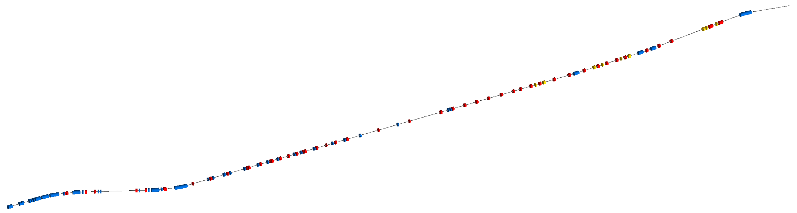

Accelerator Test Facility 2 - KEK, Japan
========================================

This is the 1.3GeV energy scaled test facility for the ILC final focus system.
The real machine consists of an approximately 70m normal conducting linac,
transfer line, racetrack damping ring and finally an extraction line. This
model represents only the ~100m extraction line.

How to run::

  bdsim --file=atf2.gmad --output=root --outfile=test1

