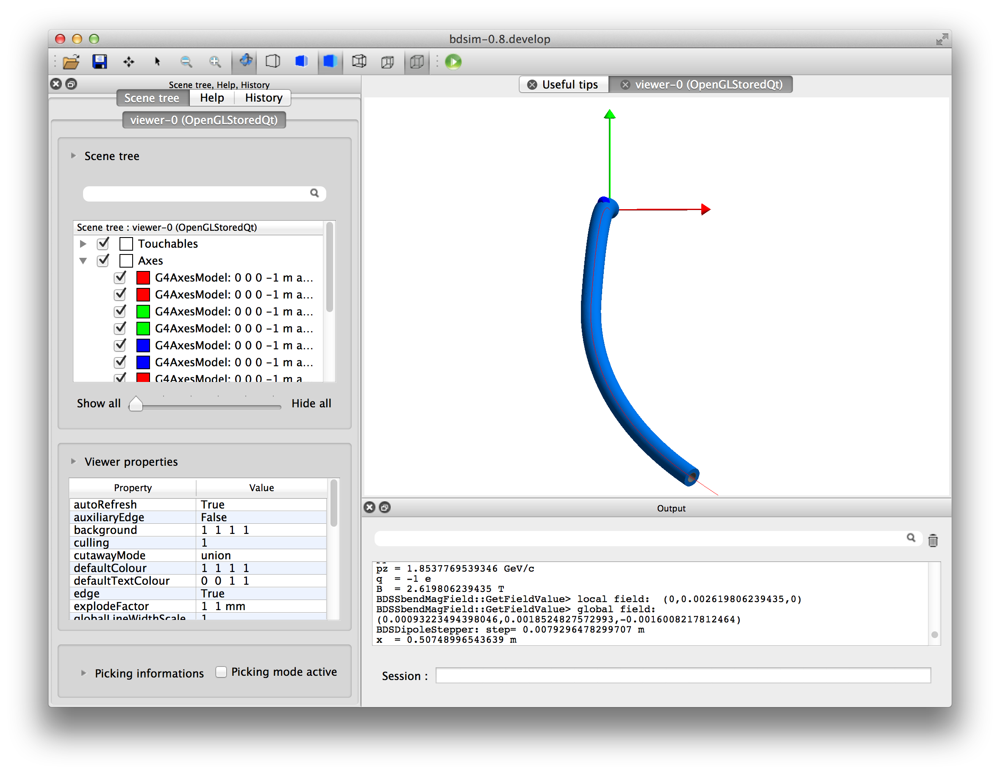

Field Transforms
================

These are various examples that test the rotation of a field and its effect on
the beam.

1_dipole_rotation
-----------------

This contains two sector bend dipoles that are rotated using a
:code:`transform3d` instance so that they bend out of the global
plane. This tests whether the dipole fields are correctly transformed
for a given element.

How to run::

  bdsim --file=1_dipole_rotation.gmad

