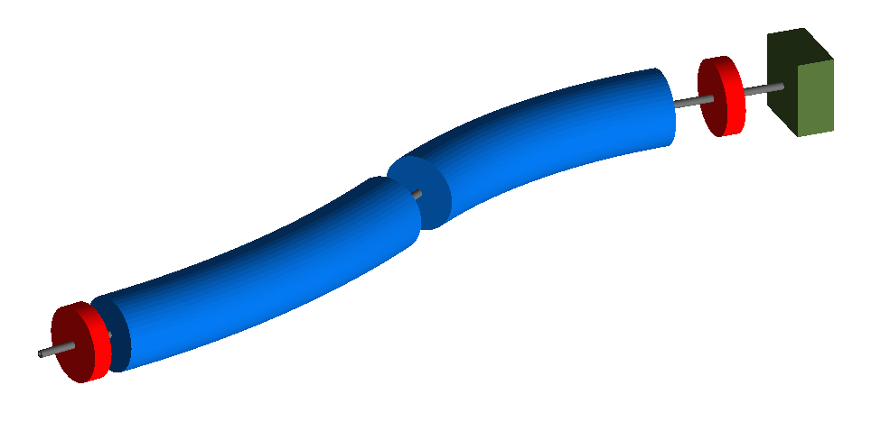
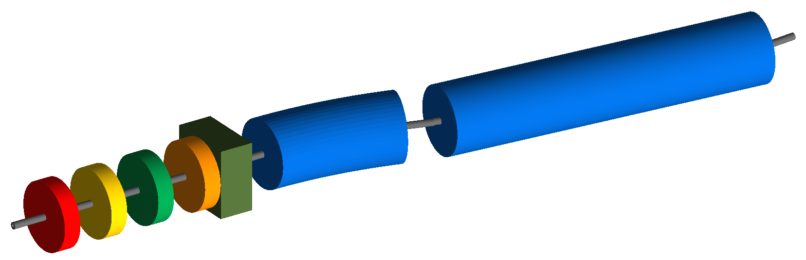

Layout
======

1_layout.gmad
-------------

A simple machine with a few dipoles, drifts and quadrupoles. This is
not matched or properly designed, but purely an example to show and test
the layout of components.

How to run::
  
  bdsim --file=1_layout.gmad

  
2_one_of_each.gmad
------------------

A small lattice with one of each component with default geometry options.

How to run::
  
  bdsim --file=2_one_of_each.gmad

