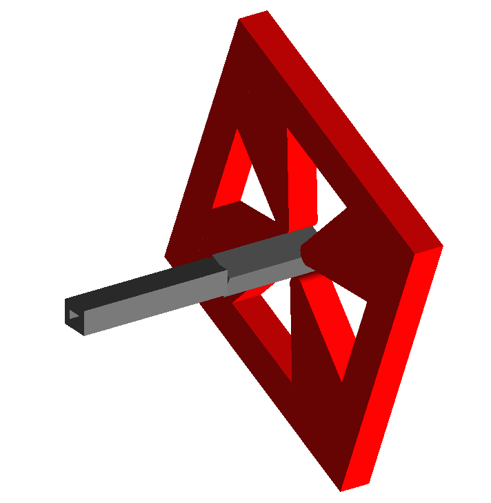
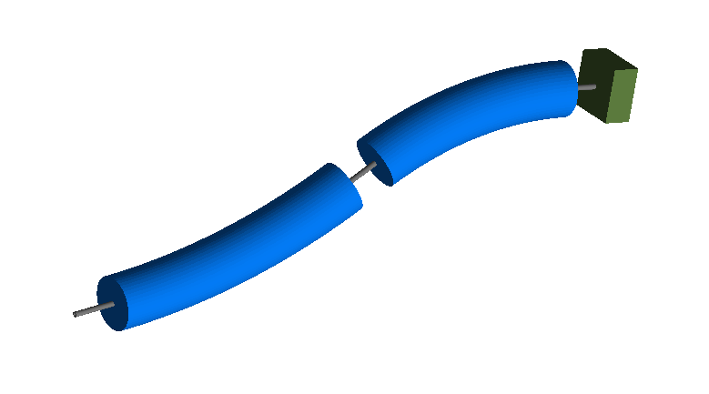

Transform3d
===========

1_rotation.gmad
---------------

A drift, followed by a :code:`transform3d` that rotates about the
beam axis, then followed by another drift and a quadrupole. The drifts have
rectangular beam pipes so the rotation caused by the :code:`transform3d` can
be seen. The quadrupole is therefore also rotated. A sampler placed at
the end will also be rotated with respect to global coordinates as the
:code:`transform3d` permanently rotates the coordinate axes.

How to run::
  
  bdsim --file=1_rotation.gmad

2_rotation_with_bends.gmad
--------------------------

A pair of sector bends but rotated to bend vertically, followed by a collimator.
This is used to demonstrate the rotation of coordinates that :code:`transform3d`
has on the beam line and demonstrates a method to create vertical bends.

How to run::
  
  bdsim --file=2_rotation_with_bends.gmad

