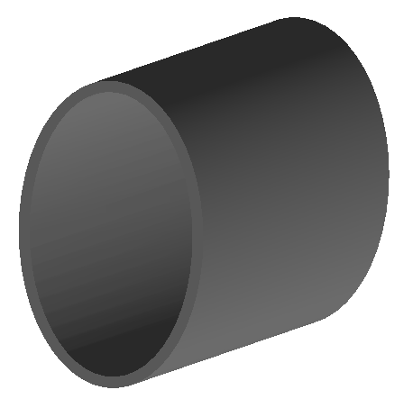

Beam Pipes
==========

1_circular.gmad
---------------

A 0.2m section of circular beam pipe - nothing particularly interesting.

How to run::
  
  bdsim --file=1_circular.gmad

.. figure:: 1_circular.png
	    :width: 40%

2_rectangular.gmad
------------------

A 0.2m section of rectangular beam pipe.

How to run::
  
  bdsim --file=2_rectangular.gmad

.. figure:: 2_rectangular.png
	    :width: 50%

3_elliptical.gmad
-----------------

A 0.2m section of elliptical beam pipe. The definition of the drift overrides
the default parameter of :code:`beampipeThickness` here.

How to run::
  
  bdsim --file=3_elliptical.gmad

4_lhc.gmad
----------

A 0.2m section of lhc-style beam pipe. The definition of the drift overrides
the default parameter of :code:`beampipeThickness` here. Additionally, :code:`aper1`,
in the definition of the drift `d1` overrides the general (degenerate)
:code:`beampipeRadius` option in options.gmad.

How to run::
  
  bdsim --file=4_lhc.gmad

5_lhcdetailed.gmad
------------------

Similary to 4), a 0.2m section of lhc-style beam pipe but with the
more detailed lhc aperture model. 

How to run::
  
  bdsim --file=5_lhcdetailed.gmad

6_rectellipse.gmad
------------------

A 0.2m section of rectangular-ellipse beam pipe. This is composed of the
intersection of a rectangle and an ellipse, unlike the lhc-style beam pipe
that is the intersection of a rectangle with a circle.

How to run::
  
  bdsim --file=5_lhcdetailed.gmad

