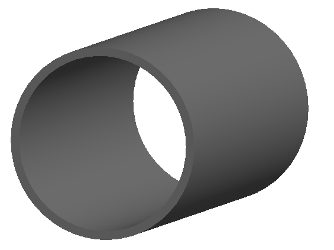

Beam Pipes
==========

1_circular.gmad
---------------

A 1m section of circular beam pipe - nothing particularly interesting.

How to run::
  
  bdsim --file=1_circular.gmad

2_rectangular.gmad
------------------

A 1m section of rectangular beam pipe.

How to run::
  
  bdsim --file=2_rectangular.gmad

3_elliptical.gmad
-----------------

A 1m section of elliptical beam pipe. The definition of the drift overrides
the default parameter of :code:`beampipeThickness` here.

How to run::
  
  bdsim --file=3_elliptical.gmad

.. figure:: 3_elliptical.png
	    :width: 50%
