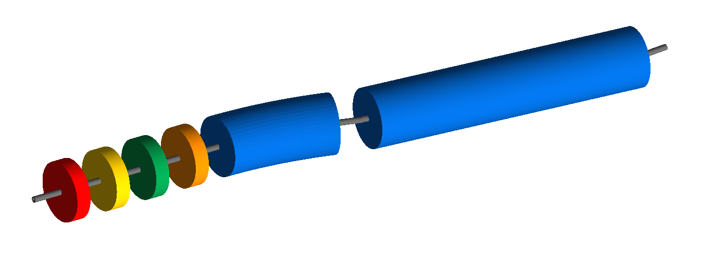
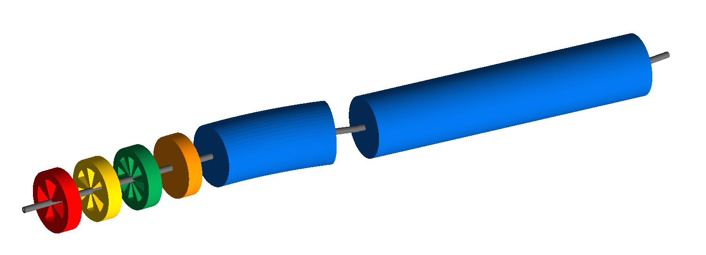
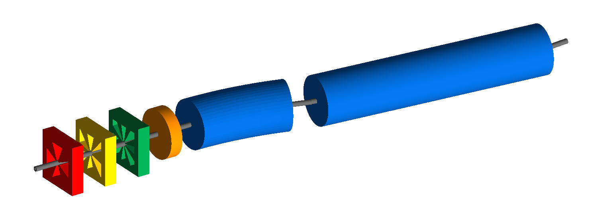
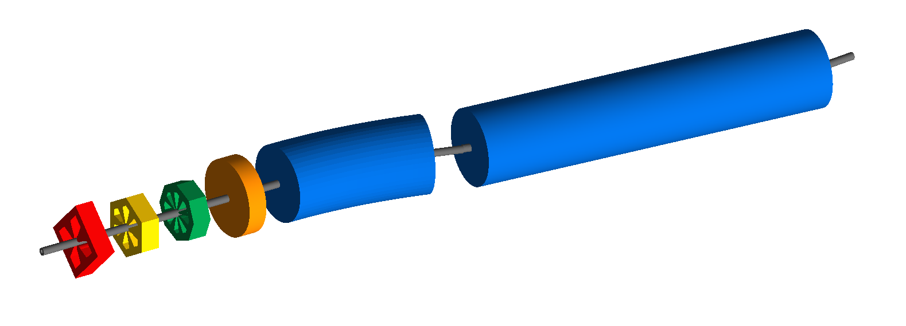
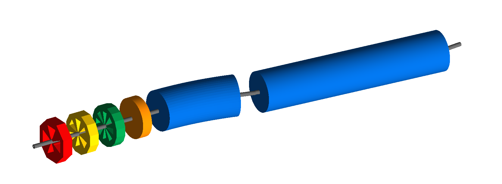

Magnet Geometry
===============

one_of_each_base.gmad
---------------------

A base file that's used (:code:`include one_of_each_base.gmad`) by
many examples in this directory. It's loosely based on the one of each
example in layout and contains one of each of the magnetic elements in
BDSIM. Each example demonstrates a different geometry possible.

1_cylindrical.gmad
------------------

Key code::

  magnetGeometryType="cylindrical";

This example uses the sequence of magnets defined in one_of_each_base.gmad
and ensures that they have cylindrical geometry. This is a little redundant
as the default is cylindrical.

How to run::
  
  bdsim --file=1_cylindrical.gmad

2_poles_circular.gmad
---------------------

Key code::

  magnetGeometryType="polescircular";

As above but with poled geometry and a circular yoke.

How to run::
  
  bdsim --file=2_poles_circular.gmad

3_poles_square.gmad
---------------------

Key code::

  magnetGeometryType="polessquare";

As above but with poled geometry and a square yoke.

How to run::
  
  bdsim --file=3_poles_square.gmad

4_poles_face.gmad
-----------------

Key code::

  magnetGeometryType="polesfacet";

As above but with poled geometry and a square yoke rotated by 45 degrees.

How to run::
  
  bdsim --file=4_poles_facet.gmad

5_poles_face_crop.gmad
----------------------

Key code::

  magnetGeometryType="polesfacetcrop";

As above but with poled geometry and a square yoke rotated by 45 degrees.
Additionally, the corner edges are cropped giving the yoke, :math:`n x 2`
edges, where :math:`n` is the number of poles the magnet has.

How to run::
  
  bdsim --file=5_poles_facet_crop.gmad

