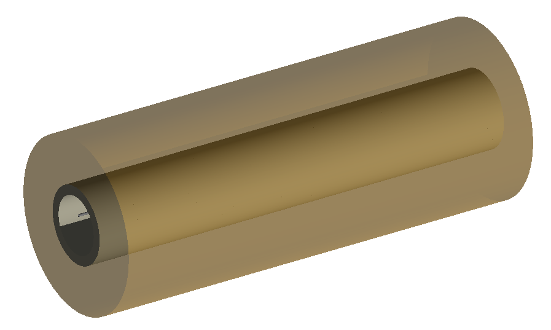
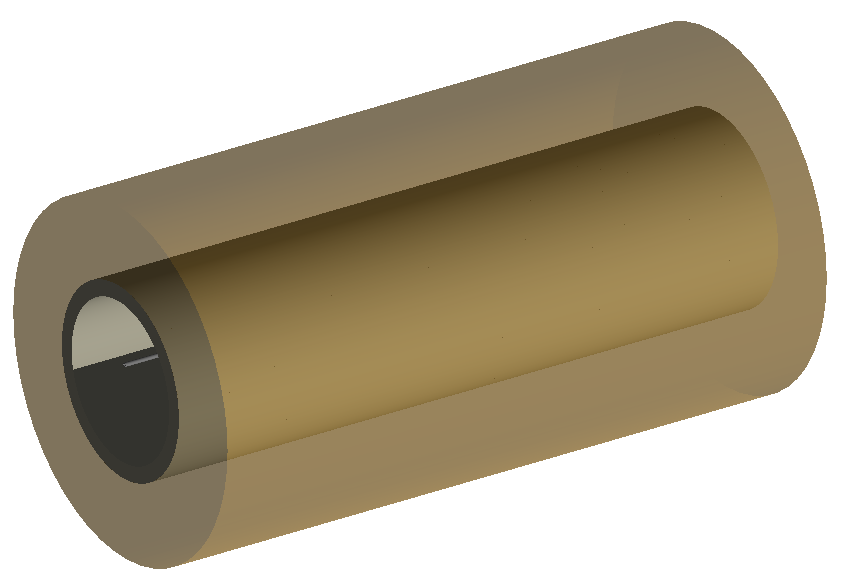
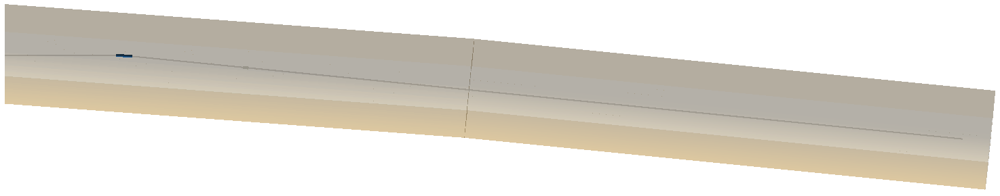
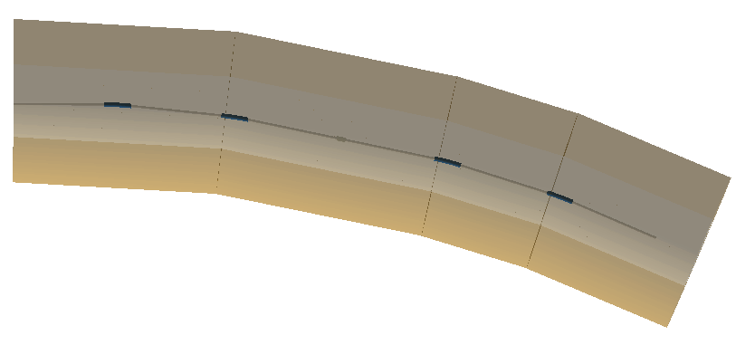
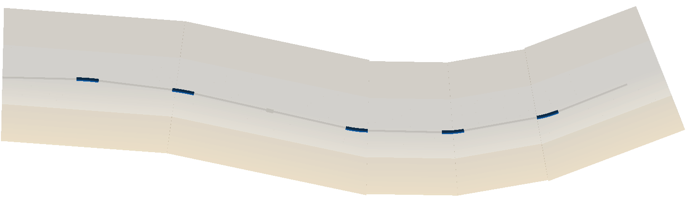
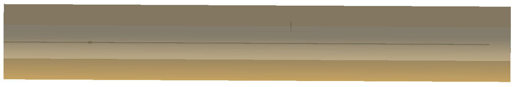
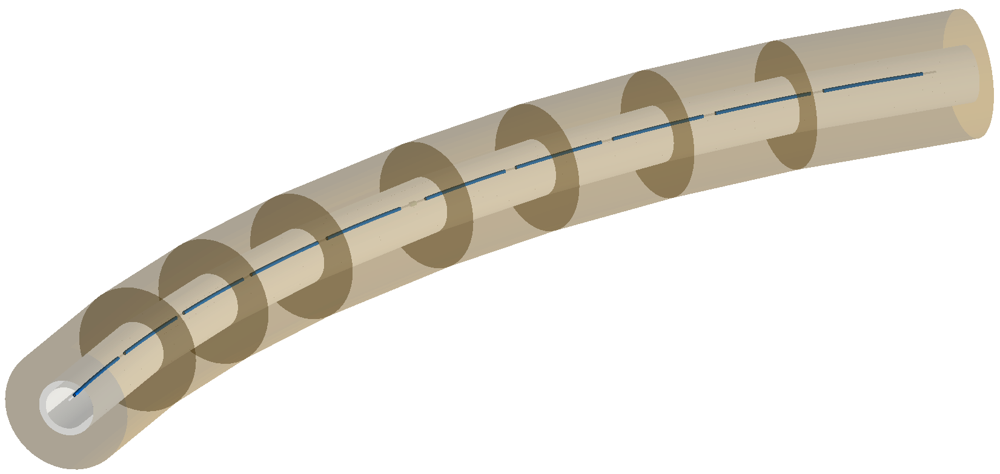
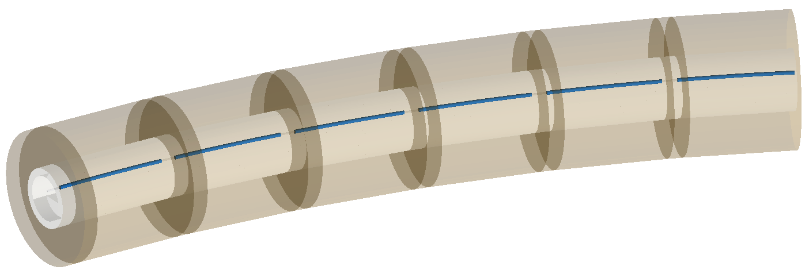

Tunnel Geometry
===============

For each tunnel test, there is an *a* and a *b* version. These are the same as the indiviual
test but with elliptical and rectangular geometry respectively. A square tunnel section
is really just a rectangular tunnel section, so this is tested as well.

1_long_straight.gmad
--------------------

A drift section, with a thin collimator that's offset so the beam definitely hits it,
followed by another long drift section. The tunnel is cylindrical, and of a typical size
of an acceleartor and offset a little bit. The floor and soil are also built. This uses
the newer modular physics lists.

This test builds one straight section of tunnel from start to finish irrespective of the
beam line as controlloed by :code:`buildTunnelStraigh=1`.

Key code::

  option, buildTunnel=1,
          buildTunnelStraight=1,
	  tunnelType="circular",
	  tunnelThickness=1*m,
	  tunnelSoilThickness=5*m,
	  tunnelMaterial="concrete",
	  soilMaterial="soil",
	  buildTunnelFloor=1,
	  tunnelFloorOffset=1.2*m,
	  tunnelAper1=5*m,
	  tunnelAper2=3*m,
	  tunnelSensitive=1,
	  tunnelVisible=1,
	  tunnelOffsetX=0.4*m,
	  tunnelOffsetY=-1.2*m;

How to run::

  bdsim --file=1_long_straight.gmad

2_long_straight_following.gmad
------------------------------

This is the same as `1_long_straight.gmad`_ but the tunnel building algorithm is allowed
to follow the beam line. As it's straight, it should result in a very similar outcome.

Key code::

  option, buildTunnelStraight=0;

How to run::

  bdsim --file=2_long_straight_following.gmad

3_initial_bend.gmad
-------------------

This lattice has a relatively strong bend at the beginning of the lattice, followed by
a long straight section. This tests the tunnel building algorithm's ability to follow
the beam line after a bend.

How to run::

  bdsim --file=3_initial_bend.gmad

4_several_bends.gmad
--------------------

This lattice has long straight sections with relatively sharp bends and this pattern is
repeated several times.

How to run::

  bdsim --file=4_several_bends.gmad

5_several_bends_back_and_forth
------------------------------

This examples is much like `4_several_bends.gmad`_ but also bends the otherway (back and forth).

How to run::

  bdsim --file=5_several_bends_back_and_forth.gmad

6_very_long_following.gmad
--------------------------

This example is much like `2_long_straight_following.gmad`_ but longer and with not round number
lengths. Being longer, the tunnel algorithm will split the tunnel sections up more than the single
section produced in 2.

How to run::

  bdsim --file=6_very_long_following.gmad

7_long_arc.gmad
---------------

This example contains more gradual bends and many of them separated by short drifts and is relatively
long. This tests part of an arc in a collider.

How to run::

  bdsim --file=7_long_arc.gmad

8_samplers.gmad
---------------

This examples is roughly based on `7_long_arc.gmad`_ (similar in form but not exactly) with the addition of
samplers on every element, including a marker at the end as well as a superfluous one at the beginning. The
tunnel geometry should break around these samplers leaving a 1 :math:`\mu m` gap to avoid geometrical
overlaps.

How to run::

  bdsim --file=8_samplers.gmad

