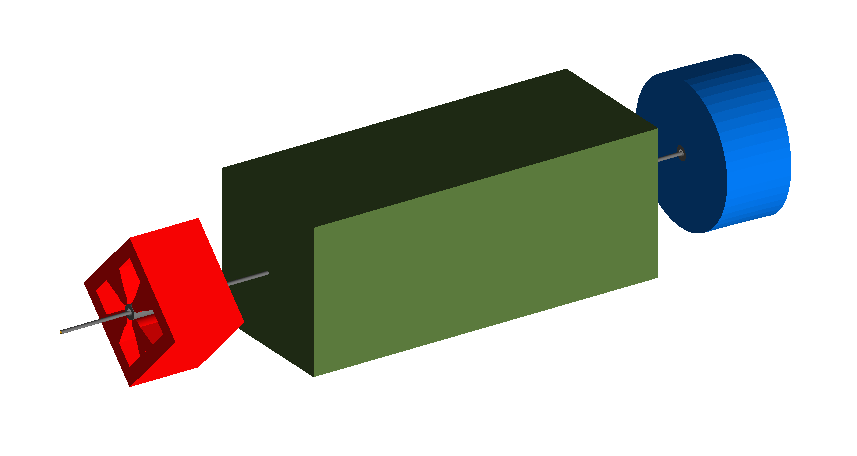

Simple Machine
==============

A simple example of a BDISM model. It has a few drift beam pipes with a
quadrupole, collimator and sector bend dipole magnet.

How to run::
  
  bdsim --file=simpleMachine.gmad

