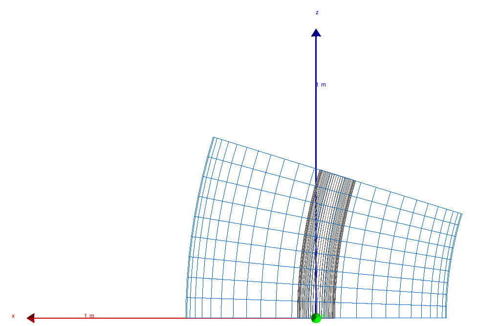
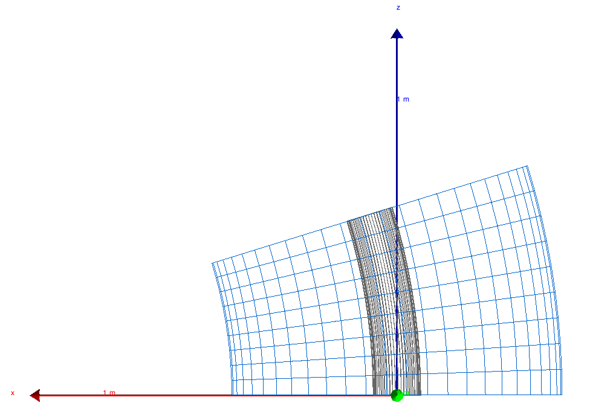
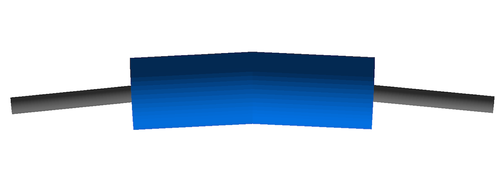

.. _dev-geometry:

Geometry
********

In :code:`bdsim.cc`, an instance of :code:`BDSDetectorConstruction` is created and registered to the
Geant4 run manager.

They geometry is dynamically built based on information from the parser instance. BDSIM is designed to
build a model of an accelerator and as such, creates a single beam line in order, element by element.
Each element is created using a component factory (:code:`BDSComponentFactory`) to instantiate
the correct class and it is then placed in a holder (:code:`BDSBeamline`) that calculates the
the cumulative coordinates of the element in the world given the already created ones. It also keeps
track of the extent of the model. Optionally, the tunnel is built with respect to the beamline. Only
after these stages, can an appropriately sized world volume be created. Each element in the beam line
is then placed into the world volume. Ultimately, the fully constructed world volume (and therefore all
of its contents - the accelerator model) is returned to Geant4, which then handles it for the simulation.

Beam Line Calculations
======================

As well as being a vector of the beam line elements, when each :code:`BDSAcceleratorComponent`
is added to the beam line, the coordinates that it should be placed in the world that represent
that element's position in the beam line are calculated. The rotation matrices and positions for
the beginning, middle and end are stored along with the :code:`BDSAcceleratorComponent` instance
in a :code:`BDSBeamlineElement` instance. A further subtelty is that any one element can be offset or
tilted with respect to the accelerator curvlinear reference ('design') trajectory, so the originals
are stored under the name 'reference' and the final positions (incorporating tilts and offsets)
are recorded without name.

Assumptions About Geometry
--------------------------

The coordinate calculation is to a degree simplified with a few basic assumptions about how
any one component affects the reference ('design') trajectory.

* A BDSAcceleratorComponent advances the reference trajectory by a length :math:`l`.
* A BDSAcceleratorComponent may change the outgoing angle of the reference trajectory
  by angle :math:`\alpha` in the horizontal (:math:`x` - :math:`z`) plane and this is
  assumed to be a single smooth change.
* Any offset in the reference trajectory at the end of a :code:`BDSAcceleratorComponent` is due
  to the change in angle through the component.
* It is not possible for the outgoing trajectory to be offset but with zero angle - ie
  a slalom or S shape.

**A Few Important Points**

* Geant4 uses the right handed coordinate system.
* Euler angles are used to rotate frames of reference and offsets are applied first.
* :math:`l` is not used for length in the code - only :code:`chordLength` or :code:`arcLength` to be explicit.
* The chord length and arclength are supplied or calculated in :code:`BDSAcceleratorComponent`.

A schematic of the chord and arc length for a :code:`BDSAcceleratorComponent` with a finite bend
angle is shown below.

.. figure:: dev_figures/chord_arc_length.pdf
	   :width: 90%
	   :align: center

	   Schematic of chord and arc length as well as reference points and planes for
	   a :code:`BDSAcceleratorComponent` that bends by finite angle :math:`\alpha`.
	  

Component Factory
=================

Beam Pipe / Aperture Factories
==============================

Magnet Factories
================

The magnet geometry is built in factories with virtual base class :code:`BDSMagnetOuterFactoryBase`. Many
factories inherit this implementing the virtual methods (one for each magnet type) and provide various
styles of magnet geometry. In this way, a new magnet style can be added easily or a factory made that
mixes and matches others by calling other factories. All factories are singletons as there need only be
one of them - although this isn't strictly required.

Angles of Bends, and Faces
==========================

Bending Angle Convention
------------------------

The two images below show the direction of bending for positive and negative angles:

* A positive angle will bend toward negative X in the x-z plane (local co-ordinates).
* A negative angle will bend toward positive X in the x-z plane (local co-ordinates).
* Note: X-axis is red, z-axis is blue, y-axis is green and points towards you.

+-+-+------------------------+----------------------------+
| | | Positive bending angle |  Negative bending angle    |
| | |      |sbendpos|        |         |sbendneg|         |
+-+-+------------------------+----------------------------+

Angles of Rectangular Bend Faces
--------------------------------

To accommodate both normal bends and those with pole face rotations, the angle of the input face and the angle
of the output face are specified. If no pole face rotation angles are specified, half the bend angle is given as
the face angles for sbends. For rbends without poleface rotation, the end faces of the magnet are parallel,
therefore the half bend angle is instead applied to the elements preceding/succeeding it.

A sequence of consecutive rbends can also be defined, however, rather than split up a single magnet into multiple
segments, the result would be similar to the sequence shown in the figure below.

	   An example sequence of rbend magnets (without pole face angles).
	  
To split an rbend into multiple segments to create a straight final magnet would require an indefinite look ahead
(beyond the current one element look ahead), to determine the total length and angle. This would then be followed
by a rotation of each segment, and a lateral offset to form the line. The current implementation would become more
prominant for a larger total angle (especially if the magnet length was short), however, given the rarity of this,
the current method can suffice for now.

Angles of Sector Bend Faces
---------------------------

Sbends can be easily broken up by the user into smaller consecutive sbends if needed. If multiple sbends are defined
as such, the input pole face angle (e1) for an sbend must be -1 times the output pole face angle (e2) of the previous
sbend, this is purely to avoid overlaps between elements. This doesn't apply to the input angle and output angle of
the first and last sbends respectively, these are effectivley the pole face rotation for the whole sequence.

Irrespective of any splitting from the user, all sbends are split into an odd number of segments. This is calculated in
:code:`CalculateNSBendSegments`. Each segment has the equal length along the reference trajectory, and the number of segment it
is split into is determined by the angle and length of the whole magnet. Shown in the figure below is a diagram of the
reference system for pole face rotations, with an example sbend. Two thirds of the sbend segments are shown as partially
transparent to highlight the changes in the face angles.

.. figure:: dev_figures/poleface_notation_sbend_devel.pdf
       :width: 50%
       :align: center

       Reference system for an sbend with pole face rotation, with screenshot partially showing
       an example sbend and the change in inputface and outputface angles along the magnet.

When there is no pole face angle specified, each sbend segment will have the same input and output angle of 0.5 times the
total bending angle, divided by the number of sbends. With a finite pole face angle(s), the input and output face angle of
each segment increases or decreases as appropriate from the first wedge (with the user specified e1) until the central wedge
is reached. (This is why the number of sbend segments must always be odd, as the angle algorithm always works towards/away
from a cental wedge). This central wedge has the face angles equal to that if no pole face angles were supplied. From the
middle wedge, the face angles are then increased/decreased as appropriate until the final wedge is created with the users
specifed e2.

There are multiple reasons for this implementation. Without the change in face angle for each segment, if a large e1 is
specified when the length of each segment is short, the projected length of the first segment would overlap with the next
segment, as indicated by the red triangle in the left figure below. Another reason is that each segment has to be rotated
slightly in order for them to sit correctly on the sbend reference trajectory. As such, when a non-zero pole face angle is
specified, the input face angle of a segment cannot be the opposite sign of the output face angle of the previous element.
Therefore the input and output faces have to be increased/decreased differently.

.. |overlap| image:: dev_figures/poleface_notation_sbend_devel_prob1.pdf
			     :width: 75%

.. |overlapcheck| image:: dev_figures/poleface_notation_sbend_devel_prob2.pdf
			     :width: 75%

+-+-+------------------------++----------------------------+
| | |    Element Overlap     ||    Element Overlap Check   |
| | |       |overlap|        ||       |overlapcheck|       |
+-+-+------------------------++----------------------------+

In certain circumstances, the situation may occur where the angles of both input and output face angles are such so that
they cause the faces to intersect within the magnet radius. For any segment that is created, the radial distance where the
faces overlap is compared to the magnet radius, and exits if it is larger. (This check is performed to avoid a Geant4 exit
with unclear errors). The radius is calculated in :code:`CalculateFacesOverlapRadius` in :code:`BDSUtilities`. This is
outlined in the above right figure. It works by taking the input and output face angles, and calculating their normal vectors
(green arrows in the above diagram). These are then rotated as appropriate so both unit vectors are in the planes of their
respective faces (red arrows). The vector to where these two lines intercept is then calculated (black arrow), and the x-component
taken as the radius. It should be noted that for non-cylindrical magnet geometries, the limit for the interception radius
is (arbitrarily) 1.25 times smaller, this is due to their geometries being transversely smaller than their cylindrical container
volumes.

Specific Element Details
========================

Rectangular Bend
----------------
