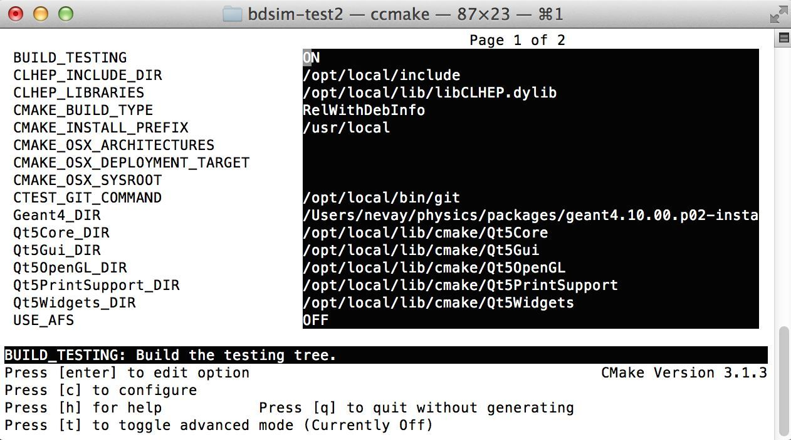

************
Installation
************

Obtaining  BDSIM
================

BDSIM may be obtained either from the BDSIM webiste
(http://www.pp.rhul.ac.uk/twiki/bin/view/JAI/BdSim) or from the GIT repository
(https://www.bitbucket.org/stewartboogert/bdsim). The user must compile it on
their system and must have Geant4 already present (or access to AFS).

We **recommend obtaining BDSIM from the git repository** as this provides an easy
method to obtain updates in the future.

From the Website
----------------

The source can be downloaded from: http://twiki.ph.rhul.ac.uk/twiki/bin/view/PP/JAI/BDsimDownload
in compressed tar format. To decompress use the following command::

  tar -xzf BDSIM-v064.tar.gz

From the GIT Repository
-----------------------

To download the source from the git repository, use the command::

  git clone https://bitbucket.org/stewartboogert/bdsim

This will create a directory called ``bdsim``, inside which all the code, examples
and documentation is provied. To obtain the python utilities that come with BDSIM,
use the following commands::

  > cd bdsim
  > git submodule init
  > git submodule update
  

Requirements
============

1) Geant4 installed or access to **AFS** [#macafsnote]_. Version 4.9.6 or higher.
2) Cmake 2.8 or higher
3) Flex 2.5.37 or higher
4) Bison 2.3 or higher
5) CLHEP 2.1.3.1 or higher
6) Boost libraries (**to be removed**)

Optional dependencies
  
7) ROOT framework for binary data output

Note, even though installed, the Geant4 environmental variables must be
available. You can test this in a terminal with::

  > echo $G4 <tab>
  $G4ABLADATA         $G4NEUTRONHPDATA    $G4RADIOACTIVEDATA  
  $G4LEDATA           $G4NEUTRONXSDATA    $G4REALSURFACEDATA  
  $G4LEVELGAMMADATA   $G4PIIDATA          $G4SAIDXSDATA
     
If these do not exists, please source the Geant4 environmental script
before installing BDISM and each time before using BDSIM. It is common
to add this to your ``.bashrc`` or profile so that it's loaded automatically
every time.::

  source path/to/geant4/installation/bin/geant4.sh

Note, if Geant4 is not installed, please see `Geant4 Installation Guide`_.

Setting Up
==========

The following sections detail the setup process for different operating systems.

Mac OSX
-------

We recommend obtaining required packages using **MacPorts** package manager,
although they can be obtained both through other package managers and by
manually downloading, compiling and installing the source for each.

Once ready, make a directory **outisde** the BDSIM source directory to build
BDSIM in::

  > ls
  bdsim
  > mkdir bdsim-build
  > ls
  bdsim          bdsim-build

From this directory use the following cmake command to configure the BDSIM
installation::

  > cd bdsim-build
  > cmake ../bdsim

This typically produces the following output, which is slightly different on each computer::

  -- The C compiler identification is AppleClang 6.0.0.6000056
  -- The CXX compiler identification is AppleClang 6.0.0.6000056
  -- Check for working C compiler: /usr/bin/cc
  -- Check for working C compiler: /usr/bin/cc -- works
  -- Detecting C compiler ABI info
  -- Detecting C compiler ABI info - done
  -- Check for working CXX compiler: /usr/bin/c++
  -- Check for working CXX compiler: /usr/bin/c++ -- works
  -- Detecting CXX compiler ABI info
  -- Detecting CXX compiler ABI info - done
  -- Configuring BDSIM 0.6.develop
  -- Build Type RelWithDebInfo
  -- Compiler supports C++11
  -- Looking for CLHEP... - found
  -- Looking for ROOT...
  -- Found ROOT 5.34/26 in /opt/local/libexec/root5
  -- ROOT support ON
  -- Boost version: 1.57.0
  -- Looking for XercesC... - found
  -- GDML support ON
  -- Looking for XML2... - found
  -- LCDD support ON
  -- Geant4 Use File: /Users/nevay/physics/packages/geant4.10.00.p02-install
     /lib/Geant4-10.0.2/UseGeant4.cmake
  -- Geant4 Definitions: -DG4_STORE_TRAJECTORY;-DG4VERBOSE;-DG4UI_USE;
     -DG4VIS_USE;-DG4UI_USE_TCSH;-DG4INTY_USE_XT;-DG4VIS_USE_RAYTRACERX;
     -DG4INTY_USE_QT;-DG4UI_USE_QT;-DG4VIS_USE_OPENGLQT;-DG4UI_USE_XM;
     -DG4VIS_USE_OPENGLXM;-DG4VIS_USE_OPENGLX;-DG4VIS_USE_OPENGL
  -- G4_VERSION: 10.0.2
  -- Found Doxygen: /opt/local/bin/doxygen (found version "1.8.9.1") 
  -- Found BISON: /opt/local/bin/bison (found version "2.7.12-4996") 
  -- Found FLEX: /opt/local/bin/flex (found version "2.5.37") 
  -- Configuring done
  -- Generating done
  -- Build files have been written to: /Users/nevay/physics/reps/bdsim-test2

Cmake will search your system for the required dependencies. In the above example, this
proceeded without any errors. In the case where a required dependecy cannot be found,
an error will be shown and cmake will stop. Please see `Configuring the BDSIM Build with
Cmake`_ for further details on how to fix this and further configure the BDSIM installation.

You can then compile BDSIM with::

  > make

BDSIM can then be installed for access from anywhere on the system with::
  
  > sudo make install

To change the installation directory, see `Configuring the BDSIM Build with Cmake`_
From any directory on your computer, ``bdsim`` should be available.  From the build directory
you can verify your installation using a serious of tests included with BDSIM. ::

  > ctest -E LONG

Scientific Linux
----------------

For SL5 you will have to use Geant 4.9.6 as Geant 4.10 onwards is not compatable.
Older version of Geant4 can be downloaded from their
`archive <http://geant4.web.cern.ch/geant4/support/source_archive.shtml>`_ . 
For SL6, we recommend the latest version of Geant4, currently 4.10.p04.  
Once ready, make a directory **outisde** the BDSIM source directory to build
BDSIM in::

  > ls
  bdsim
  > mkdir bdsim-build
  > ls
  bdsim          bdsim-build

From this directory use the following cmake command to configure the BDSIM
installation::

  > cd bdsim-build
  > cmake ../bdsim

You can then compile BDSIM with::

  > make

BDSIM can then be installed for access from anywhere on the system with::
  
  > sudo make install

To change the installation directory, see `Configuring the BDSIM Build with Cmake`_
From any directory on your computer, ``bdsim`` should be available.  From the build directory
you can verify your installation using a serious of tests included with BDSIM.::

  > ctest -E LONG

Scientific Linux with AFS Access
--------------------------------

When the machine has AFS connection, then the dependent packages like Geant4 can
be taken from there and don't need to be installed. The same compiler version needs
to be used for BDSIM as the one for Geant4.  The following scripts must be sourced
before using cmake.  

For version 0.6 and older::
  
  source /afs/cern.ch/user/j/jsnuveri/public/gcc46-setup.sh
  source /afs/cern.ch/user/j/jsnuveri/public/geant4.9.6-setup.sh

For the tags 0.61-0.63 and the develop branch::
  
  source /afs/cern.ch/user/j/jsnuveri/public/gcc47-setup.sh
  source /afs/cern.ch/user/j/jsnuveri/public/geant4.10-setup.sh

After this, the installation procedure for `Scientific Linux`_ should be followed.

Configuring the BDSIM Build with Cmake
--------------------------------------

To either enter paths to dependcies manually, or edit the configuration, the following
command will give you and interface to cmake (from ``bdsim-build`` directory)::

  > ccmake .

You can then use **up** and **down** arrows to select the desired parameter and
**enter** to edit it. If the parameter is a path, press **enter** again after
entering the path to confirm.

Once the parameter has been edited, you can proceed by pressing **c** to run
the configuration and if successful, follow this by **g** to generate the
build. After configuring the installation, you should run::

  > make
  > sudo make install

Note, ``sudo`` is used here as the default installation directory will be a
system folder. You can however, specify a different directory in the above **ccmake**
configuration and that won't require the ``sudo`` command. The installation directory
can be specified by editing the ``CMAKE_INSTALL_PREFIX`` variable.

Making DOxygen Documentation
----------------------------

From the build directory, after running ``make``, run the following command::

  > make doc

to make the DOxygen documentation in a folder called ``DOxygen``.

Geant4 Installation Guide
-------------------------

BDSIM now builds with the most recent versions of Geant4, but only the BDSIM develop
branch. A new official version will be released soon (January 2015). If not built
with **MacPorts** then download the 4.10.01 version or an older version from the
Geant archive. Move and unpack to a suitable place ::

  > tar -xzf geant4.10.04.tar.gz
  > ls
  geant4.10.04

Make a build and installation directory **outside** that directory ::
  
  > mkdir geant4.10.04-build
  > mkdir geant4.10.04-install

Configure Geant4 using cmake ::

  > cd geant4.10.04-build
  > cmake ../geant4.10.04

At this point it's useful to define the installation directory for Geant4 by
modifying the cmake configuration as generally desbribed in
`Configuring the BDSIM Build with Cmake`_. ::

  > ccmake .

Once the installation directory is set, press ``c`` to run the configuration
process, and when complete, press ``g`` to generate the build. Geant4 can then
be compiled ::

  > make

Note, Geant4 can take around 20 minutes to compile on a typical computer. If your
computer has multiple cores, you can significantly decrease the time required to
compile by using extra cores ::

  > make -jN

where ``N`` is the number of cores on your computer [#ncoresnote]_. Geant4 should
then be installed ::

  > make install

Note, if you've specified the directory to install, you will not need the ``sudo``
command, however, if you've left the settings as default, it'll be installed
in a colder that requires ``sudo`` permissions such as ``/usr/local/``.

**IMPORTANT** - you should source the Geant4 environment each time before running
BDSIM as this is required for the physics models of Geant4.  This can be done using ::

  > source path/to/geant4.10.04-install/bin/geant4.sh

It may be useful to add this command to your ``.bashrc`` or profile script.

Troubleshooting
===============

Below are a list of possible encountered problems. If you experience problems beyond these,
please contact us (see :ref:`support-section`).

1) Visualisation does not work::

     "parameter value is not listed in the candidate List."
   
   Check which graphics systems BDSIM has available, this is shown in the terminal when
   you run BDSIM ::
     
     You have successfully registered the following graphics systems.
     Current available graphics systems are:
     G4HepRepFile (HepRepFile)
     OpenGLImmediateQt (OGLIQt)
     OpenGLImmediateX (OGLIX)
     OpenGLImmediateXm (OGLIXm)
     OpenGLStoredQt (OGLSQt)
     OpenGLStoredX (OGLSX)
     OpenGLStoredXm (OGLSXm)
     RayTracerX (RayTracerX)
   
   If your favourite is not there check that Geant4 is correctly compiled with those
   graphics system.

2) Error from OpenGL::
     
     G4OpenGLImmediateX::CreateViewer: error flagged by negative view id in
     G4OpenGLImmediateXViewer creation.

   Check that your graphics card driver is installed correctly for your memory card
   and possibly reinstall them. For Ubuntu for example, run::

     fglrxinfo

   If fglrx is installed and working well you should see an output similar to::
     
     > fglrxinfo
     display: :0  screen: 0
     OpenGL vendor string: Advanced Micro Devices, Inc.
     OpenGL renderer string: ATI Radeon HD 4300/4500 Series       
     OpenGL version string: 3.3.11399 Compatibility Profile Context

   For more info see https://help.ubuntu.com/community/BinaryDriverHowto/AMD

3) Build does not work - GLIBCXX errors, where a message similar to this is shown ::

     Linking CXX executable bdsim
     /afs/cern.ch/sw/lcg/external/geant4/9.6.p02/x86_64-slc6-gcc46-opt
     /lib64/libG4analysis.so: undefined reference to
     'std::__detail::_List_node_base::_M_unhook()@GLIBCXX_3.4.15'
   
   This means compiler version for BDSIM is different from the one used to compile Geant4.
   Make sure it is the same compiler version. Remember to start from a clean build
   directory otherwise cmake does **NOT** update the compiler version.

.. rubric:: Footnotes

.. [#macafsnote] Note, **AFS** is not supported with Mac OSX as there is no Mac compatible
		 version of Geant4 available on AFS.

.. [#ncoresnote] If your computer supports hyper-threading, you can use twice the number of
		 cores with the ``make -jN`` command. Ie a computer has 4 cores and supports
		 hyper-threading, can suuport up to ``make -j8``.  Exceeding this number will
		 result in slower than normal compilation.
