.. _model-description:

================================
Model Description - Input Syntax
================================

GMAD Syntax
-----------

GMAD is a language specifically for BDSIM but is made to be human readable
and very similar to MADX.

* arithmetic expressions can be defined
* binary operators +, -, \*, /, ^ are valid
* unary operators +, -, are valid
* boolean operators <, >, <=, >=, <>, == are valid
* every expression **must** end with a semi-colon;
* no name can begin with a number

The following functions are provided

* sqrt
* cos
* sin
* tan
* exp, e
* log
* acos
* asin
* abs

Examples::

   x = 1;
   y = 2.5-x;
   z = sin(x) + log(y) -8e5;

Coordinates & Units
-------------------

In Geant4, global euclidean coordinates are used for tracking purposes, however,
in describing a lattice with BDSIM, curvilinear coordinates are used as is common with
accelerators (X,Y,S).

**GMAD uses SI units**

==============================  =========================
Name                            Units
==============================  =========================
length                          [m] (metres)
time                            [s] (seconds)
angle                           [rad] (radians) 
quadrupole coefficient          [m :math:`^{-2}` ]
multipole coefficient 2n poles  [m :math:`^{-n}` ]
electric voltage                [MV] (Megavolts)
electric field strength         [MV/m]
particle energy                 [GeV]
particle mass                   [GeV/c :math:`^2` ]
particle momentum               [GeV/c :math:`^2` ]
beam current                    [A] (Amperes)
particle charge                 [e] (elementary charges)
emittances                      [pi m mrad]
density                         [g/cm :math:`^{3}` ] 
temperature                     [K] (Kelvin)
pressure                        [atm] (atmosphere)
mass number                     [g/mol]
==============================  =========================

Some useful predefined values / units are:

==========  =================================
Name        Value
==========  =================================
pi          3.14159265358979
GeV         1
eV          :math:`10^{-9}`
keV         :math:`10^{-6}`
MeV         :math:`10^{-3}`
TeV         :math:`10^{3}`
MV          1
Tesla       1
rad         1
mrad        :math:`10^{-3}`
urad        :math:`10^{-6}`
clight      :math:`2.99792458 \times 10^{8}`
m           1
cm          :math:`10^{-2}`
mm          :math:`10^{-3}`
um          :math:`10^{-6}`
nm          :math:`10^{-9}`
pm          :math:`10^{-12}`
s           1
ms          :math:`10^{-3}`
us          :math:`10^{-6}`
ns          :math:`10^{-9}`
ps          :math:`10^{-12}`
==========  =================================

For example, one can write either :code:`100*eV` or :code:`0.1*keV` to specify an energy in GMAD
and both are equivalent.

Useful Commands
---------------

* :code:`print;` prints all elements
* :code:`print, line;` prints all elements in line
* :code:`print, option;` prints the value of option
* :code:`print, parameter;` prints the value of parameter, where parameter could be your own defined parameter
* :code:`stop;` or `return;` exists parser
* :code:`if () {};` if construct

Lattice Description
-------------------

A model of the accelerator is given to BDSIM via input text files in the GMAD language.
The overall program structure should follow:

1) Component definition
2) Sequence definition (of the already defined components)
3) Which sequence to use
4) Where to record output (samplers)
5) A beam distribution
6) Options, including which physics lists, number to simulate etc.

These are described in the following sections

Lattice Elements
----------------

Any element in BDSIM is described with the following pattern::

  type: name, parameter=value, parameter="string";

.. note:: Notice the ':', the inverted commas for a string parameter and that each
	  functional line must end with a semi-colon. Spaces will be ignored

The following elements may be defined

* `drift`_
* `rbend`_
* `sbend`_
* `quadrupole`_
* `sextupole`_
* `octupole`_
* `decapole`_
* `multipole`_
* `vkick`_
* `hkick`_
* `rf`_
* `rcol`_
* `ecol`_
* `muspoiler`_
* `solenoid`_
* `laser`_
* `transform3d`_
* `element`_
* `marker`_

These are detailed in the following sections.

Magnet Strength Polarity
^^^^^^^^^^^^^^^^^^^^^^^^

.. note:: BDSIM strictly follows the MADX definition of magnet strength parameter
	  `k` - "a **positive** `k` corresponds to **horizontal focussing** for a
	  **positively** charged particle. This therefore indicates a positive `k`
	  corresponds to horizontal defocussing for a negatively charged particle.
	  However, MADX treats all particles as positively charged for tracking purposes.

.. versionadded:: 0.7

		  
		  BDSIM currently treats k absolutely so to convert a MADX lattice for
		  negatively particles, the MADX k values must be multiplied by -1. The
		  pybdsim converter provides an option called `flipmagnets` for this
		  purpose.  This may be revised in future releases depending on changes
		  to MADX.
		  

drift
^^^^^

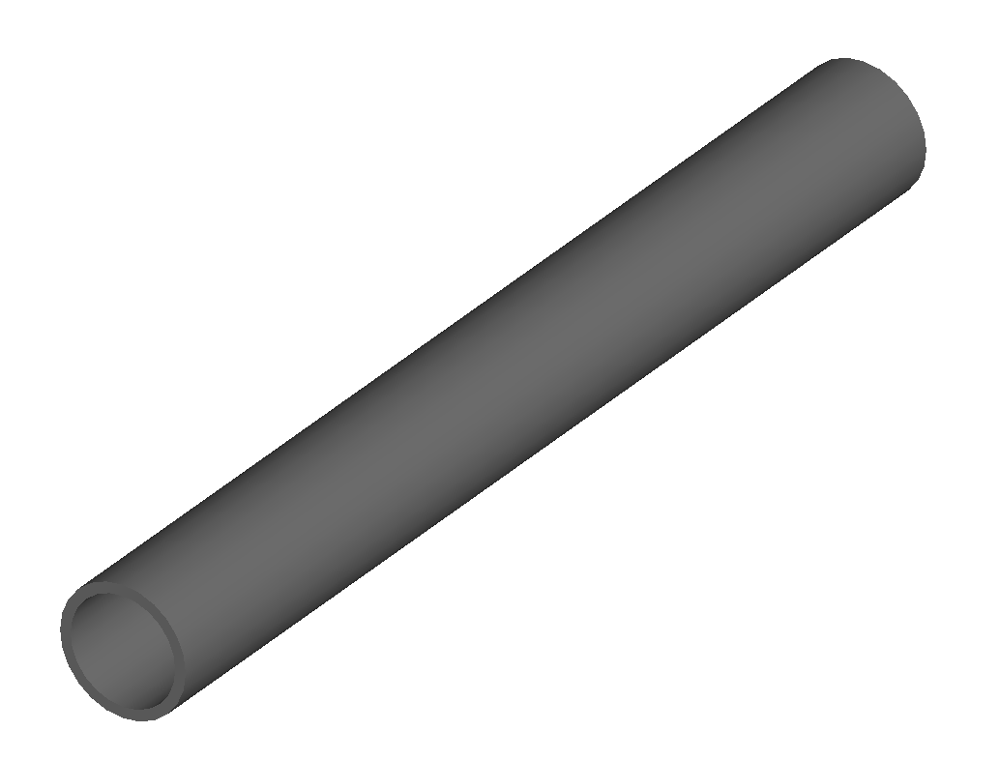

:code:`drift` defines a straight beam pipe with no field.

================  ===================  ==========  =========
parameter         description          default     required
`l`               length [m]           0.1         yes
`vacuumMaterial`  the vacuum material  vacuum      no
                  to use, can be user
		  defined
================  ===================  ==========  =========

* The `aperture parameters`_ may also be specified.

Examples::

   l203b: drift, l=1*m;
   l204c: drift, l=3*cm, beampipeRadius=10*cm;

rbend
^^^^^
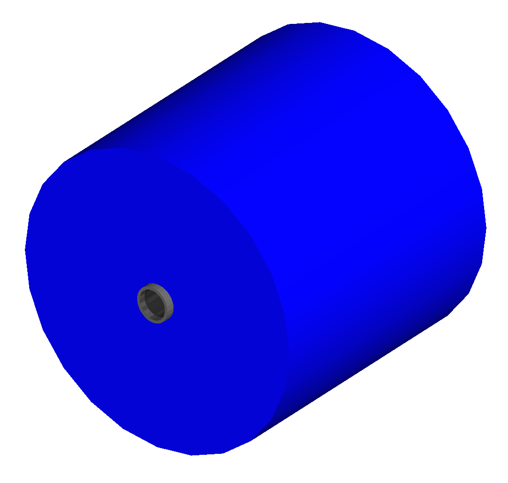

`rbend` defines a rectangular bend magnet. Either the total bending angle, `angle`
for the nominal beam energy can be specified or the magnetic field, `B` in Tesla.
`B` overrides angle. The faces of the magnet are normal to the chord of the
input and output point. Furthermore, an additional very small drift section is
added on either side and the magnetic field up-scaled for the shorter field
length to ensure that the magnet body fits inside the start and end faces
of the element volume and doesn't protrude into the previous and next elements.

================  =====================  ==========  ===========
parameter         description            default     required
`l`               length [m]             0.1         yes
`angle`           angle [rad]            0           yes, or `B`
`B`               magnetic field [T]     0           yes
`material`        magnet outer material  Iron        no
================  =====================  ==========  ===========

* The `aperture parameters`_ may also be specified.
* The `magnet geometry parameters`_ may also be specified.

.. note:: For large angles (> 100 mrad) particles may hit the aperture as the beam pipe is
	  is represented by a straight (chord) section and even nominal energy particles
	  may hit the aperture depending on the degree of tracking accuracy specified. In this
	  case, consider splitting the `rbend` into multiple ones.

.. note:: As of v0.64 a combined quadrupole component is not possible, but is under
	  development

Examples::

   MRB20: rbend, l=3*m, angle=0.003;
   r1: rbend, l=5.43m, beampipeRadius=10*cm, B=2*Tesla;

sbend
^^^^^

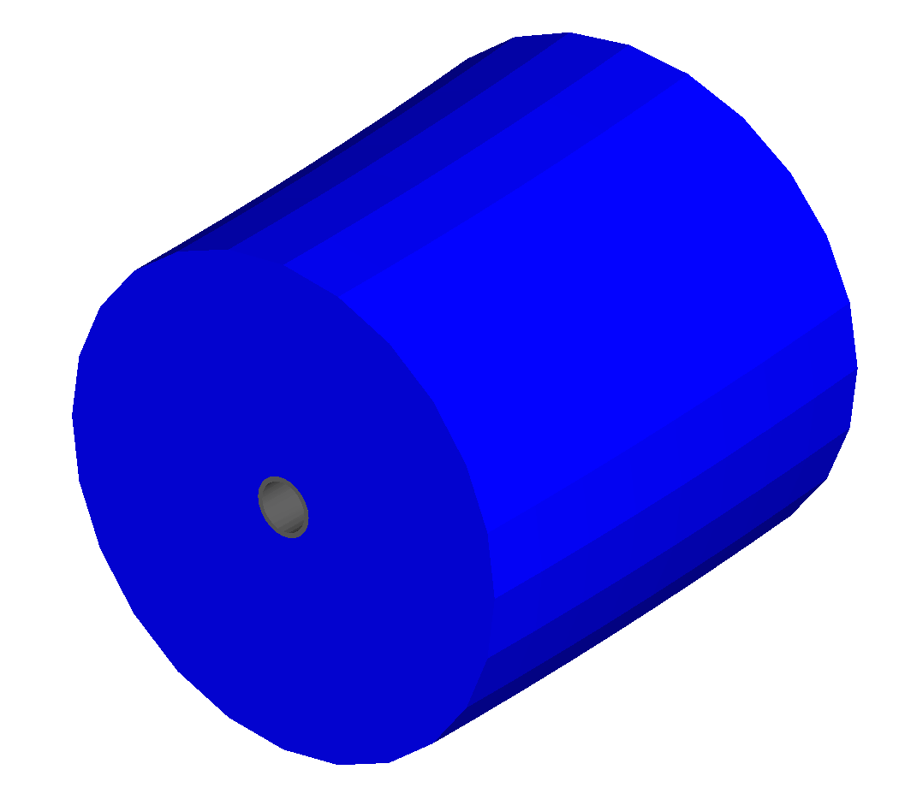

`sbend` defines a sector bend magnet. Either the total bending angle, `angle`
for the nominal beam energy can be specified or the magnetic field, `B` in Tesla.
`B` overrides angle. The faces of the magnet are normal to the curvilinear coordinate
system. `sbend` magnets are made of a series of straight segments. If the specified
(or calculated from `B` field) bending angle is large, the `sbend` is automatically
split such that the maximum tangential error in the aperture is 1 mm. For an LHC for
example with a bending angle of ~0.005rad and l = 14m, the magnet is typically split
into 5 co-joined `sbend` magnets.

================  =====================  ==========  ===========
parameter         description            default     required
`l`               length [m]             0.1         yes
`angle`           angle [rad]            0           yes, or `B`
`B`               magnetic field [T]     0           yes
`material`        magnet outer material  Iron        no
================  =====================  ==========  ===========

* The `aperture parameters`_ may also be specified.
* The `magnet geometry parameters`_ may also be specified.

.. note:: As of v0.64 a combined quadrupole component is not possible, but is under
	  development

Examples::

   s1: sbend, l=14.5*m, angle=0.005, magnetGeometryType="lhcright";
   mb201x: sbend, l=304.2*cm, b=1.5*Tesla;

quadrupole
^^^^^^^^^^

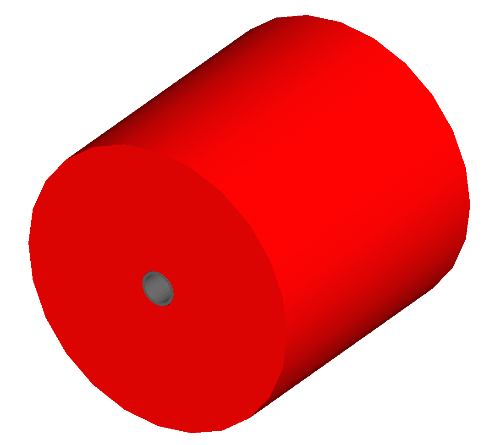

`quadrupole` defines a quadrupole magnet. The strength parameter `k1` is defined as
:math:`k1 = 1/(B \rho)~dB_{y}~/~dx~[m^{-2}]`. `ks1` specifies a skew quadrupole
component as with `k1` but rotated by 45 degrees.

================  ===========================  ==========  ===========
parameter         description                  default     required
`l`               length [m]                   0.1         yes
`k1`              quadrupole coefficient       0           yes
`ks1`             skew quadrupole coefficient  0           no
`material`        magnet outer material        Iron        no
================  ===========================  ==========  ===========

* The `aperture parameters`_ may also be specified.
* The `magnet geometry parameters`_ may also be specified.
* See `Magnet Strength Polarity`_ for polarity notes.

Examples::

   q1: quadrupole, l=0.3*m, k1=45.23;
   qm15ff: quadrupole, l=20*cm, k1=95.2;

sextupole
^^^^^^^^^

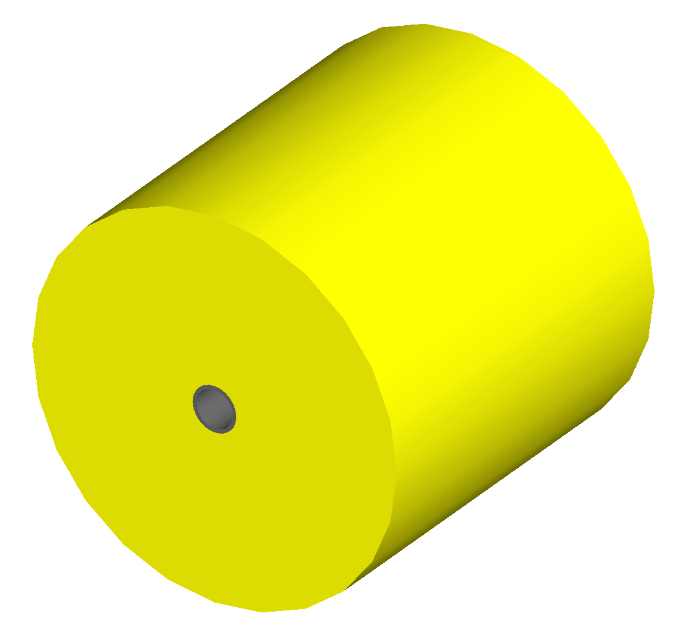

`sextupole` defines a sextupole magnet. The strength parameter `k2` is defined as
:math:`k2 = 1/(B \rho)~dB^{2}_{y}~/~dx^{2}~[m^{-3}]`. `ks2` specifies a skew sextupole
component as with `k2` but rotated by 30 degrees.

================  ===========================  ==========  ===========
parameter         description                  default     required
`l`               length [m]                   0.1         yes
`k2`              sextupole coefficient        0           yes
`ks2`             skew sextupole coefficient   0           no
`material`        magnet outer material        Iron        no
================  ===========================  ==========  ===========

* The `aperture parameters`_ may also be specified.
* The `magnet geometry parameters`_ may also be specified.
* See `Magnet Strength Polarity`_ for polarity notes.

Examples::

   sx1: sextupole, l=0.5*m, k2=4.678;
   sx2: sextupole, l=20*cm, k2=45.32, magnetGeometry="normalconducting";
		    
octupole
^^^^^^^^

`octupole` defines an octupole magnet. The strength parameter `k3` is defined as
:math:`k3 = 1/(B \rho)~dB^{3}_{y}~/~dx^{3}~[m^{-4}]`. `ks3` specifies a skew octupole
component as with `k3` but rotated by 15 degrees.

================  ===========================  ==========  ===========
parameter         description                  default     required
`l`               length [m]                   0.1         yes
`k3`              octupole coefficient         0           yes
`ks3`             skew octupole coefficient    0           no
`material`        magnet outer material        Iron        no
================  ===========================  ==========  ===========

* The `aperture parameters`_ may also be specified.
* The `magnet geometry parameters`_ may also be specified.
* See `Magnet Strength Polarity`_ for polarity notes.

Examples::

   oct4b: octupole, l=0.3*m, k3=32.9;
		    
decapole
^^^^^^^^
.. warning:: To be completed - not yet implemented

`decapole` defines a decapole magnet. The strength parameter `k4` is defined as
:math:`k4 = 1/(B \rho)~dB^{4}_{y}~/~dx^{4}~[m^{-5}]`. `k43` specifies a skew decapole
component as with `k4` but rotated by 7.5 degrees.

================  ===========================  ==========  ===========
parameter         description                  default     required
`l`               length [m]                   0.1         yes
`k4`              decapole coefficient         0           yes
`ks4`             skew decapole coefficient    0           no
`material`        magnet outer material        Iron        no
================  ===========================  ==========  ===========

* The `aperture parameters`_ may also be specified.
* The `magnet geometry parameters`_ may also be specified.
* See `Magnet Strength Polarity`_ for polarity notes.

Examples::

   MXDEC3: decapole, l=0.3*m, k3=32.9;
  

multipole
^^^^^^^^^

`multipole` defines a general multipole magnet.

* The `aperture parameters`_ may also be specified.
* The `magnet geometry parameters`_ may also be specified.
* See `Magnet Strength Polarity`_ for polarity notes.
  
Examples::

   **To be completed**

vkick
^^^^^

`vkick` or `vkicker` defines a vertical dipole magnet and has the same parameters as `sbend`.

* The `aperture parameters`_ may also be specified.
* The `magnet geometry parameters`_ may also be specified.

Examples::

   KX15v: vkick, angle=0.01*mrad;

hkick
^^^^^

`hkick` or `hkicker` defines a horizontal dipole magnet and has the same parameters as `sbend`.

* The `aperture parameters`_ may also be specified.
* The `magnet geometry parameters`_ may also be specified.

Examples::

   KX17h: hkick, angle=0.01;

rf
^^^^

`rf` or `rfcavity` defines an rf cavity

================  ===========================  ==========  ===========
parameter         description                  default     required
`l`               length [m]                   0.1         yes
`gradient`        field gradient [MV/m]         0           yes
`material`        outer material               Iron        no
================  ===========================  ==========  ===========

* The `aperture parameters`_ may also be specified.

.. note:: Be careful with the sign of the gradient with respect to the sign of
	  the primary particle

Examples::

   RF4f: rf, l=3*m, gradient=10*MV;

rcol
^^^^

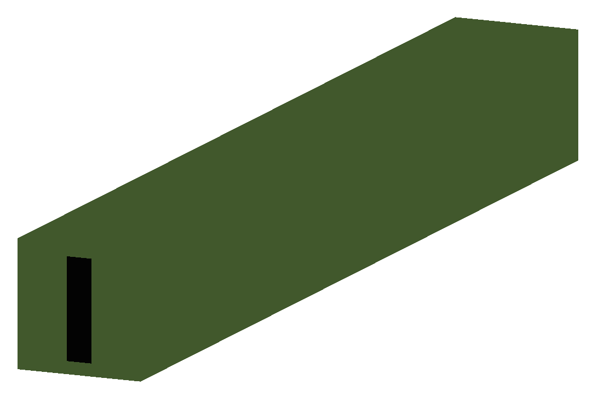

`rcol` defines a rectangular collimator. The aperture is rectangular and the eternal
volume is square.

================  ============================  ==========  ===========
parameter         description                   default     required
`l`               length [m]                    0.1         yes
`xsize`           horizontal half aperture [m]  0           yes
`ysize`           vertical half aperture [m]    0           yes
`material`        outer material                Iron        no
`outerDiameter`   outer full width [m]          global      no
================  ============================  ==========  ===========

.. note:: `rcol` and `ecol` do not currently implement tilt, so if an angled collimator
	  is required, a `transform3d` should before and afterwards in the sequence to
	  rotate the coordinate frame before and afterwards. See `transform3d`_ for further
	  details and examples.

Examples::

   TCP15: rcol, l=1.22*m, material="graphite", xsize=104*um, ysize=5*cm;

ecol
^^^^

`ecol` defines an elliptical collimator. This is exactly the same as `rcol` except that
the aperture is elliptical and the `xsize` and `ysize` define the horizontal and vertical
half axes respectively.

muspoiler
^^^^^^^^^

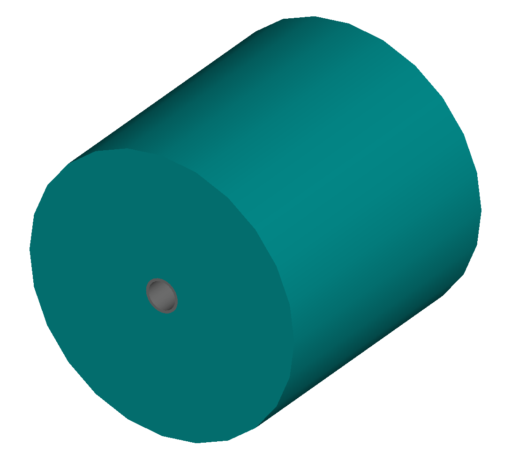

`muspoiler` defines a muon spoiler, which is a rotationally magnetised iron cylinder with
a beam pipe in the middle. There is no magnetic field in the beam pipe.

================  ============================  ==========  ===========
parameter         description                   default     required
`l`               length [m]                    0.1         yes
`B`               magnetic field [T]            1           yes
`material`        outer material                Iron        no
`outerDiameter`   outer full width [m]          global      no
================  ============================  ==========  ===========

solenoid
^^^^^^^^

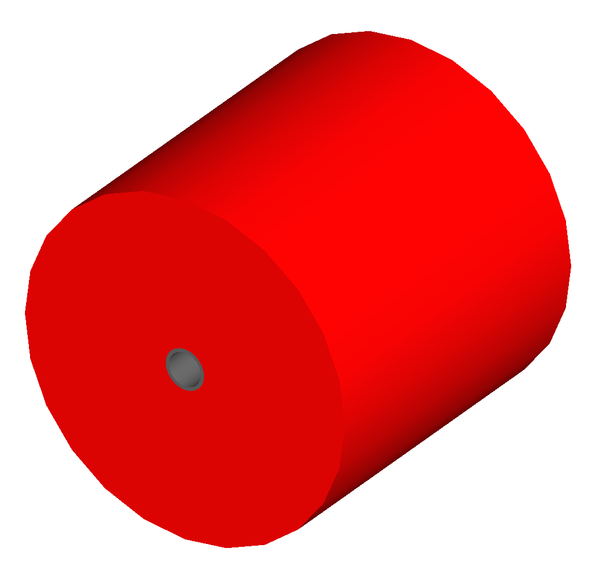

`solenoid` defines a solenoid magnet. This utilises a thick lens transfer map with a
hard edge field profile so it is not equivalent to split a single solenoid into multiple
smaller ones. **This is currently under development**. The strength parameter `ks` is
defined as :math:`ks =`.

================  ============================  ==========  ===========
parameter         description                   default     required
`l`               length [m]                    0.1         yes
`ks`              solenoid strength [ ]         0           yes
`material`        outer material                Iron        no
`outerDiameter`   outer full width [m]          global      no
================  ============================  ==========  ===========

* See `Magnet Strength Polarity`_ for polarity notes.

Examples::

   atlassol: solenoid, l=20*m, ks=0.004;

laser
^^^^^

`laser` defines a drift section with a laser beam inside. The laser acts as a static target
of photons.

================  =================================================  ==========  ===========
parameter         description                                        default     required
`l`               length of drift section [m]                        0.1         yes
`x`, `y`, `z`     components of laser direction vector (normalised)  (1,0,0)     yes
`waveLength`      laser wavelength [m]                               532*nm      yes
================  =================================================  ==========  ===========

Examples::

   laserwire: laser, l=1*um, x=1, y=0, z=0, wavelength=532*nm;

transform3d
^^^^^^^^^^^

`transform3d` defines an arbitrary 3-dimensional transformation of the the curvilinear coordinate
system at that point in the beam line sequence.  This is often used to rotate components by a large
angle.

================  ============================  ==========  ===========
parameter         description                   default     required
`x`               x offset                      0           no
`y`               y offset                      0           no
`z`               z offset                      0           no
`phi`             phi Euler angle               0           no
`theta`           theta Euler angle             0           no
`psi`             psi Euler angle               0           no
================  ============================  ==========  ===========

.. note:: this permanently changes the coordinate frame, so care must be taken to undo any rotation
	  if it intended for only one component.

Examples::

   rcolrot: transform3d, psi=pi/2;

element
^^^^^^^

`element` defines an arbitrary element that's defined by external geometry and magnetic field
maps. Several geometry formats are supported. The user must supply the length (accurately) as
well as a diameter such that the geometry will be contained in a box that has horizontal and
vertical size of diameter.

================  ===============================  ==========  ===========
parameter         description                      default     required
`geometry`        filename of geometry             NA          yes
`l`               length                           NA          yes
`outerDiameter`   diameter of component [m]        NA          yes
`bmap`            filename of magnetic field map   NA          no
================  ===============================  ==========  ===========

`geometry` and `bmap` require the input string to be of the format `format:filename`, where
`format` is the geometry format being used (`gdml` | `mokka`) and filename is the filename of
the geometry file.

.. note:: The length must be larger than the geometry so that it is contained within it and
	  no overlapping geometry will be produced. However, care must be taken as the length
	  will be the length of the component inserted in the beamline.  If this is much larger
	  than the size requried for the geometry, the beam may be mismatched into the rest of
	  the accelerator. A common practice is to add a picometre to the length of the geometry.

Examples::

   detector: element, geometry="gdml:atlasreduced.gmdl", outerDiameter=10*m,l=44*m;
   detec: element, geometry="mokka:qq.sql", bmap ="mokka:qq.bmap", l=5*m, outerDiameter=0.76*m;

marker
^^^^^^
`marker` defines a point in the lattice. This element has no physical length and is only
used as a reference. For example, a `sampler` (see `samplers - output`_ )
is used to record particle passage at the
front of a component but how would you record particles exiting a particular component?
The intended method is to use a `marker` and place it in the sequence after that element
then attach a sampler to the marker.

Examples::

   m1: marker;
   

Aperture Parameters
-------------------

For elements that contain a beam pipe, several aperture models can be used. These aperture
parameters can be set as the default for every element using the :code:`option` command
(see `options`_ ) and
can be overridden for each element by specifying them with the element definition.  The aperture
is controlled through the following parameters:

* `apertureType`
* `beampipeRadius` or `aper1`
* `aper2`
* `aper3`
* `aper4`
* `vacuumMaterial`
* `beampipeThickness`
* `beampipeMaterial`

For each aperture model, a different number of parameters are required. Here, we follow the MADX
convention and have four parameters and the user must specify them as required for that model.
BDSIM will check to see if the combination of parameters is valid. `beampipeRadius` and `aper1`
are degenerate.
  
+-------------------+--------------+-------------------+-----------------+---------------+---------------+
| Aperture Model    | # of         | `aper1`           | `aper2`         | `aper3`       | `aper4`       |
|                   | parameters   |                   |                 |               |               |
+===================+==============+===================+=================+===============+===============+
| `circular`        | 1            | radius            | NA              | NA            | NA            |
+-------------------+--------------+-------------------+-----------------+---------------+---------------+
| `rectangular`     | 2            | x half width      | y half width    | NA            | NA            |
+-------------------+--------------+-------------------+-----------------+---------------+---------------+
| `elliptical`      | 2            | x semi-axis       | y semi-axis     | NA            | NA            |
+-------------------+--------------+-------------------+-----------------+---------------+---------------+
| `lhc`             | 3            | x half width of   | y half width of | radius of     | NA            |
|                   |              | rectangle         | rectangle       | circle        |               |
+-------------------+--------------+-------------------+-----------------+---------------+---------------+
| `lhcdetailed`     | 3            | x half width of   | y half width of | radius of     | NA            |
|                   |              | rectangle         | rectangle       | circle        |               |
+-------------------+--------------+-------------------+-----------------+---------------+---------------+
| `rectellipse`     | 4            | x half width of   | y half width of | x semi-axis   | y semi-axis   |
|                   |              | rectangle         | rectangle       | of ellipse    | of ellipse    |
+-------------------+--------------+-------------------+-----------------+---------------+---------------+

..
  to be completed in code before being added to the manual
  | `racetrack`       | 3            | horizontal offset | vertical offset | radius of     | NA            |
  |                   |              | of circle         | of circle       | circular part |               |
  +-------------------+--------------+-------------------+-----------------+---------------+---------------+
  | `octagon`         | 4            | x half width      | y half width    | angle 1 [rad] | angle 2 [rad] |
  +-------------------+--------------+-------------------+-----------------+---------------+---------------+

These parameters can be set with the *option* command as the default parameters
and also on a per element basis, that overrides the defaults for that specific element.
Up to four parameters
can be used to specify the aperture shape (*aper1*, *aper2*, *aper3*, *aper4*).
These are used differently for each aperture model and match the MADX aperture definitions.
The required parameters and their meaning are given in the following table.

MADX `racetrack` and `octagon` are currently unavailable but will be completed shortly.

Magnet Geometry Parameters
--------------------------

As well as the beam pipe, magnet beam line elements also have further outer geometry beyond the
beam pipe. This geometry typically represents the magnetic poles and yoke of the magnet but there
are several geometry types to choose from. The possible different styles are described below and
syntax **examples** can be found in *examples/features/geometry/4_magnets/*.

The magnet geometry is controlled by the following parameters.

.. note:: These are all specified using the `option` command.

+-----------------------+--------------------------------------------------------------+---------------+-----------+
| parameter             | description                                                  | default       | required  |
+-----------------------+--------------------------------------------------------------+---------------+-----------+
| `magnetGeometryType`  | The style of magnet geometry to use. One of:                 | `cylindrical` | no        |
|                       | `cylindrical`, `polescircular`, `polessquare`, `polesfacet`, |               |           |
|                       | `polesfacetcrop`, `lhcleft` and `lhcright`                   |               |           |
+-----------------------+--------------------------------------------------------------+---------------+-----------+
| `outerDiameter`       | **full** horizontal width of the magnet (m)                  | 1 m           | no        |
+-----------------------+--------------------------------------------------------------+---------------+-----------+
| `outerMaterial`       | material of the magnet                                       | "iron"        | no        |
+-----------------------+--------------------------------------------------------------+---------------+-----------+

Example::

  option, magnetGeometryType = "polesfacetcrop",
          outerDiameter = 0.5*m;
	  

.. versionadded:: 0.7

		  `magnetGeometryType` parameter allows different generic magnet geometry
		  libraries to be used. Before, only cyclindrical geometry was available.
		  Examples of other geometry types are described below.

.. deprecated:: 0.65
		`boxSize` - this is still accepted by the parser for backwards compatibility
		but users should use the `outerDiameter` keyword where possible.

.. warning:: The choice of magnet outer geometry will significantly affect the beam loss pattern in the
	     simulation as particles and radiation may propagate much further along the beam line when
	     a magnet geometry with poles is used.

.. note:: Should a custom selection of various magnet styles be required for your simulation, please
	  contact us (see :ref:`feature-request` and this can be added - it is a relatively simple processes.
	  

Cylindrical (Default) - "`cylindrical`"
^^^^^^^^^^^^^^^^^^^^^^^^^^^^^^^^^^^^^^^

The beam pipe is surrounded by a cylinder of material (the default is iron) whose outer diameter
is controlled by the `outerDiameter` parameter. In the case of beam pipes that are not circular
in cross-section, the cylinder fits directly against the outside of the beam pipe.

This geometry is the default and useful when a specific geometry is not known. The surrounding
magnet volume acts to produce secondary radiation as well as act as material for energy deposition,
therefore this geometry is best suited for the most general studies.

This geometry will be selected by **not** specifying any `option, magnetGeometryType`. If however,
another magnet geometry is used as `option, magnetGeometryType`, the `magnetGeometryType` keyword
can be used to override this on a per element basis.
		    
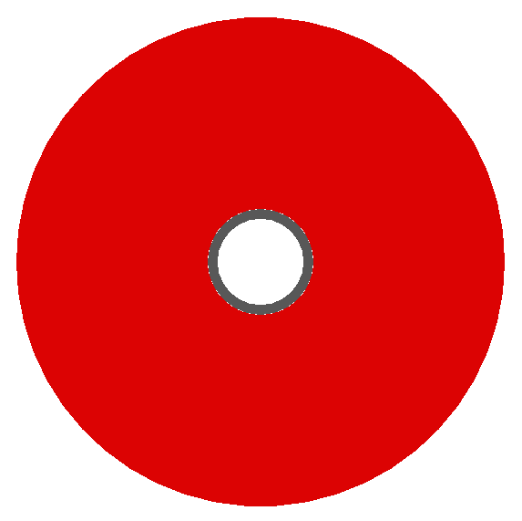
				  

			  
+--------------------+---------------------+
| |cylindricalquad|  +  |cylindricalsext|  +
+--------------------+---------------------+

.. raw:: latex

    \newpage
    

Poles Circular - "`polescircular`"
^^^^^^^^^^^^^^^^^^^^^^^^^^^^^^^^^^

This magnet geometry has simple iron poles according to the order of the magnet and the yoke is
represented by an annulus. Currently no coils are implemented. If a non-symmetric beam pipe
geometry is used, the larger of the horizontal and vertical dimensions of the beam pipe will be
used to create the circular aperture at the pole tips.

.. versionadded:: 0.7

			  
+-----------------+------------------+
| |circularquad|  +  |circularsext|  +
+-----------------+------------------+

.. raw:: latex

    \newpage

Poles Square - "`polessquare`"
^^^^^^^^^^^^^^^^^^^^^^^^^^^^^^

This magnet geometry has again, individual poles according to the order of the magnet but the
yoke is an upright square section to which the poles are attached. This geometry behaves in the
same wasy as `polescircular` with regard to the beam pipe size.

.. versionadded:: 0.7

`outerDiameter` is the full width of the the magnet horizontally as shown in the figure below,
 **not** the diagonal width.

			  
+---------------+----------------+
| |squarequad|  +  |squaresext|  +
+---------------+----------------+

.. raw:: latex

    \newpage

Poles Faceted - "`polesfacet`"
^^^^^^^^^^^^^^^^^^^^^^^^^^^^^^

This magnet geometry is much like `polessquare`, however the yoke is such that the pole always
joins at a flat piece of yoke and not in a corner. This geometry behaves in the
same wasy as `polescircular` with regard to the beam pipe size.

.. versionadded:: 0.7

`outerDiameter` is the full width as shown in the figure.

			  
+--------------+---------------+
| |facetquad|  +  |facetsext|  +
+--------------+---------------+

.. raw:: latex

    \newpage
    

Poles Faceted with Crop - "`polesfacetcrop`"
^^^^^^^^^^^^^^^^^^^^^^^^^^^^^^^^^^^^^^^^^^^^

This magnet geometry is quite similar to `polesfacet`, but the yoke in between each
pole is cropped to form another facet. This results in this magnet geometry having
double the number of poles as sides.

.. versionadded:: 0.7

`outerDiameter` is the full width horizontally as shown in the figure.

.. |facetcropsext| image:: figures/polefacetcrop_sextupole.png
			   :width: 60%
			  
+------------------+-------------------+
| |facetcropquad|  +  |facetcropsext|  +
+------------------+-------------------+

.. raw:: latex

    \newpage

LHC Left & Right - "`lhcleft`" | "`lhcright`"
^^^^^^^^^^^^^^^^^^^^^^^^^^^^^^^^^^^^^^^^^^^^^

.. versionadded:: 0.7

`lhcleft` and `lhcright` provide more detailed magnet geometry appropriate for the LHC. Here, the
left and right suffixes refer to the shift of the magnet body with respect to the reference beam line.
Therefore, `lhcleft` has the magnet body shifted to the left in the direction of beam travel and the
'active' beam pipe is the right one. Vice versa for the `lhcright` geometry.

For this geometry, only the `sbend` and `quadrupole` have been implemented.  All other magnet geometry
defaults to the cylindrical set.

This geometry is parameterised to a degree regarding the beam pipe chosen.  Of course, parameters similar
to the LHC make most sense as does use of the `lhcdetailed` aperture type. Examples are shown with various
beam pipes and both `sbend` and `quadrupole` geometries.

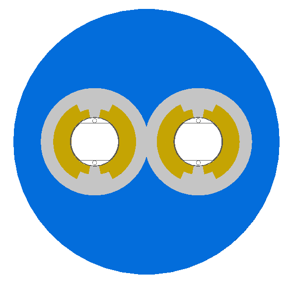

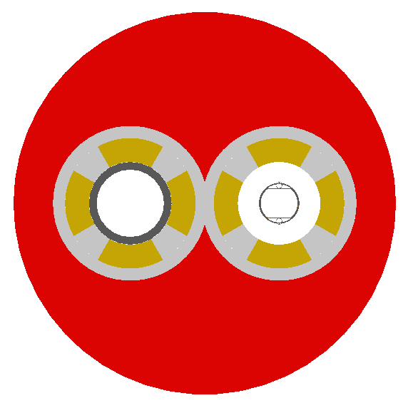

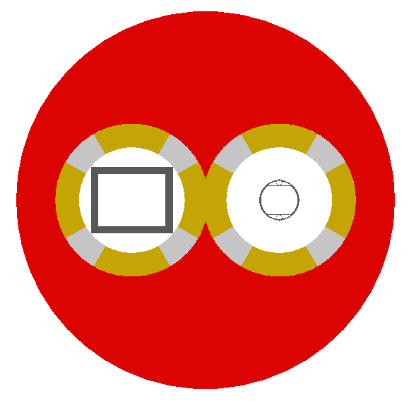

+-----------------------------+-----------------------+
| |lhcleft_sbend|             | |lhcleft_quadrupole|  |
+-----------------------------+-----------------------+
| |lhcleft_quadrupole_square| | |lhcleft_sextupole|   |
+-----------------------------+-----------------------+

Offsets & Tilts - Component Misalignment
----------------------------------------

To simulate a real accelerator it may be necessary to introduce measured placement offsets or misalignments
and rotations. Every component can be displaced transversely and rotated along the axis of the beam propagation.

.. note:: Components that have a finite angle (rbend and sbend) will only respond to vertical offsets as
	  horizontal offsets and rotations may lead to overlapping geometry. This limitation will be addressed
	  in posible future releases, but necessitates significant changes to the geometry construction.

.. note:: A right-handed coordinate system is used and the beamline built along the `z` direction.
	  
The misalignments can be controlled through the following parameters

+--------------+-----------------------------------------------------------------------------------+
| Parameter    | Default value                                                                     | 
+==============+===================================================================================+
| `offsetX`    | horizontal displacement of the component [m]                                      |
+--------------+-----------------------------------------------------------------------------------+
| `offsetY`    | vertical displacement of the component [m]                                        |
+--------------+-----------------------------------------------------------------------------------+
| `tilt`       | rotation of component clockwise facing in the direction of the beamline `z` [rad] |
+--------------+-----------------------------------------------------------------------------------+

Examples::

  d1: drift, l=1*m, offsetX=1*cm;
  d2: drift, l=0.5*m, offsetY = 0.3*cm, tilt=0.003;

Lattice Sequence
----------------

Once all the necessary components have been defined, they must be placed in a sequence to make
a lattice. Elements can be repeated [#doublesamplernote]_. A sequence of elements is defined by
a `line`_. Lines of lines can be made to describe the accelerator sequence programmatically i.e.
::

   d1: drift, l=3*m;
   q1: quadrupole, l=0.1*m, k1=0.684;
   q2: quadrupole, l=0.1*m, k1=-0.684;
   fodo: line = (q1,d1,q2,d1);
   transportline: line(fodo, fodo, fodo, fodo);
   

line
^^^^

`line` defines a sequence of elements. ::

  name: line=(element1, element2, element3, ... );

where `element` can be any element or line. Lines can also be reversed using ::
  
  line_name : line=-(line_2)

or within another line by::

  line=(line_1,-line_2)

Reversing a line also reverses all nested lines within.

use - Defining which Line to Use
^^^^^^^^^^^^^^^^^^^^^^^^^^^^^^^^

Once all elements and at least one `line` is defined, the main sequence of the
beam line can be defined. This must be defined using the following syntax::

  use, period=<line_name>

Examples::
   
   d1: drift, l=3.2*m;
   q1: quadrupole, l=20*cm, k1=4.5;
   q2: quadrupole, l=20*cm, k1=-4.5;
   fodo: line=(d1,q1,d1,q2,d1);
   use, period=fodo;

Samplers - Output
-----------------

Normally, the only output BDSIM would produce is the various particle loss histograms,
as well as the coordinates of energy deposition hits. To observe the particles at a
point in the beam lattice a `sampler` can be used. Samplers are attached to an already
defined element and record all the particles passing through a plane at the entrance
to that element. They are defined using the following syntax::

  sample, range=<element_name>

where `element_name` is the name of the element you wish to sample. Depending on the
output format chosen, the element name may be recorded in the output (ROOT output only).

To place a sampler after an item, attach it to the next item. If however, you wish
to record the coordinates at the end of the line or with another name, you must define
a marker, place it in the sequence and then define a sampler that uses that marker::

  d1: drift, l=2.4*m;
  endoftheline: marker;
  l1: line=(d1,d1,d1,d1,endoftheline);
  use,period=l1;

  sample, range=endoftheline;

.. note:: Samplers **can only** be defined **after** the main sequences has been defined
	  using the `use` command (see `use - Defining which Line to Use`_). Failure to do
	  so will result in an error and BDSIM will exit.

.. warning:: A sampler attached to the first item (therefore at the beginning of the beamline)
	     may not record all primary particles. This is due to the bunch distribution having
	     a finite length in z and some of the particles (typically half) start in front of
	     the sampler. This is not an error, but as expected. It is best not to put a sampler
	     on the first element, but to use the recorded primary coordinates in the output.
	  

Physics Lists
-------------

BDSIM can exploit all the physics processes that come with Geant4. As with any Geant4 program
and simulation it is very useful to define the physical processes that should be simulated so
that the simulation is both relevant and efficient. Rather than specify each individual process
for every individual particle, a series of "physics lists" are provided that are a predetermined
set of physics process suitable for a certain application. BDSIM follows the Geant4 ethos in this
regard.

The physics list can be selected with the following syntax::

  option, physicsList="physicslistname";

.. note:: Some physics lists allow biasing and re-weighting for some processes to further improve
	  simulation efficiency. (See `options`_ for more details).

Physics Lists In BDSIM
^^^^^^^^^^^^^^^^^^^^^^

.. table check in latex before commit
.. tabularcolumns:: |p{5cm}|p{10cm}|
		    
============================  ============================================================
standard                      transportation of primary particles 
                              only - no scattering in material.
em_standard                   transportation of primary particles, 
                              ionization, bremsstrahlung, 
                              Cerenkov, multiple scattering.
em_low                        the same as `em_standard` but using low 
                              energy electromagnetic models.
em_single_scatter             **TBC**.
em_muon                       `em_standard` plus muon production 
                              processes with biased muon 
                              cross-sections.
lw                            list for laser wire simulation - 
                              `em_standard` and "laserwire" 
                              physics, which is Compton Scattering 
			      with total cross-section 
			      renormalized to 1.
merlin                        transportation of primary particles, and 
                              the following processes 
                              for electrons: multiple scattering, 
			      ionisation, and bremsstrahlung.
hadronic_standard             `em_standard` plus fission, neutron 
                              capture, neutron and proton 
                              elastic and inelastic scattering.
hadronic_muon                 `hadronic_standard` plus muon production 
                              processes with biased muon 
                              cross-sections.
hadronic_QGSP_BERT            `em_standard` plus hadronic physics 
                              using the quark gluon string 
                              plasma (QGSP) model and the Bertini 
			      cascade model (BERT).
hadronic_QGSP_BERT_muon       `hadronic_QGSP_BERT` plus muon 
                              production processes with biased muon 
                              cross-sections.
hadronic_FTFP_BERT            `em_standard` plus hadronic physics 
                              using the Fritiof model followed 
                              by Reggion cascade and Precompound and 
			      evaporation models for the 
			      nucleus de-excitation (FTFP) model and 
			      the Bertini cascade model 
			      (BERT).
hadronic_FTFP_BERT_muon       `hadronic_FTFP_BERT` plus muon 
                              production processes with biased muon 
                              cross-sections.
hadronic_QGSP_BERT_HP_muon    `hadronic_QGSP_BERT_muon` plus high 
                              precision low energy neutron 
                              scattering models.
============================  ============================================================

Options
-------

Various simulation details can be controlled through the `option` command. Options are defined
using the following syntax::

  option, <option_name>=<value>;

If the value is a string and not a number, it should be enclosed in "double inverted commas".
Multiple options can be defined at once using the following syntax::

  option, <option1> = <value>,
          <option2> = <value>;

options in BDSIM
^^^^^^^^^^^^^^^^ 

Below is a full list of all options in BDSIM. If the option is boolean, 1 or 0 can be used
as their value.

+----------------------------------+-------------------------------------------------------+
| Option                           | Function                                              |
+==================================+=======================================================+
| **Common Parameters**            |                                                       |
+----------------------------------+-------------------------------------------------------+
| beampipeRadius                   | default beam pipe inner radius [m]                    |
+----------------------------------+-------------------------------------------------------+
| beampipeThickness                | default beam pipe thickness [m]                       |
+----------------------------------+-------------------------------------------------------+
| beampipeMaterial                 | default beam pipe material                            |
+----------------------------------+-------------------------------------------------------+
| boxSize                          | default accelerator component full width [m]          |
+----------------------------------+-------------------------------------------------------+
| randomSeed                       | the integer seed value for the random number          |
|                                  | generator                                             |
+----------------------------------+-------------------------------------------------------+
| ngenerate                        | number of primary particles to simulate               |
+----------------------------------+-------------------------------------------------------+
| elossHistoBinWidth               | the width of the histogram bins [m]                   |
+----------------------------------+-------------------------------------------------------+
| physicsList                      | the physics list to use                               |
+----------------------------------+-------------------------------------------------------+
| thresholdCutCharged              | the minimum energy above which to simulate electron   |
|                                  | and positrons - any below this energy will be killed  |
+----------------------------------+-------------------------------------------------------+
| thresholdCutPhotons              | the minimum energy above which to simulate photons -  |
|                                  | any below this energy will be killed                  |
+----------------------------------+-------------------------------------------------------+
| stopSecondaries                  | whether to stop secondaries or not (default = false)  |
+----------------------------------+-------------------------------------------------------+
| stopTracks                       | whether to stop tracks after                          |
|                                  | interaction (default = false)                         |
+----------------------------------+-------------------------------------------------------+
| circular                         | whether the accelerator is circular or not            |
+----------------------------------+-------------------------------------------------------+
| printModuloFraction              | the fraction of events to print out (default 0.1)     |
+----------------------------------+-------------------------------------------------------+
| **Geometry Parameters**          |                                                       |
+----------------------------------+-------------------------------------------------------+
| samplerDiameter                  | diameter of samplers (default 8 m) [m]                |
+----------------------------------+-------------------------------------------------------+
| includeIronMagFields             | whether to include magnetic fields in the magnet      |
|                                  | poles                                                 |
+----------------------------------+-------------------------------------------------------+
| sensitiveBeamlineComponents      | whether all beam line components record energy loss   |
+----------------------------------+-------------------------------------------------------+
| sensitiveBeamPipe                | whether the beam pipe records energy loss             |
+----------------------------------+-------------------------------------------------------+
| vacuumMaterial                   | the material to use for the beam pipe vacuum          |
+----------------------------------+-------------------------------------------------------+
| vacuumPressure                   | the pressure of the vacuum gas                        |
+----------------------------------+-------------------------------------------------------+
| **Tracking Parameters**          |                                                       |
+----------------------------------+-------------------------------------------------------+
| deltaChord                       | chord finder precision                                |
+----------------------------------+-------------------------------------------------------+
| deltaIntersection                | boundary intersection precision                       |
+----------------------------------+-------------------------------------------------------+
| chordStepMinimum                 | minimum step size                                     |
+----------------------------------+-------------------------------------------------------+
| lengthSafety                     | element overlap safety (caution!)                     |
+----------------------------------+-------------------------------------------------------+
| minimumEpsilonStep               | minimum relative error acceptable in stepping         |
+----------------------------------+-------------------------------------------------------+
| maximumEpsilonStep               | maximum relative error acceptable in stepping         |
+----------------------------------+-------------------------------------------------------+
| deltaOneStep                     | set position error acceptable in an integration step  |
+----------------------------------+-------------------------------------------------------+
| **Physics Processes Parameters** |                                                       |
+----------------------------------+-------------------------------------------------------+
| synchRadOn                       | whether to use synchrotron radiation processes        |
+----------------------------------+-------------------------------------------------------+
| srTrackPhotons                   | whether to track synchrotron radiation photons        |
+----------------------------------+-------------------------------------------------------+
| srLowX                           | minimum synchrotron radiation energy as a fraction of |
|                                  | `E critical` ( 0 > `srLowX` > 1 )                     |
+----------------------------------+-------------------------------------------------------+
| srLowGamE                        | lowest synchrotron photon energy to track             |
+----------------------------------+-------------------------------------------------------+
| srMultiplicity                   | a factor multiplying the number of synchrotron        |
|                                  | photons                                               |
+----------------------------------+-------------------------------------------------------+
| prodCutPhotons                   | standard overall production cuts for photons          |
+----------------------------------+-------------------------------------------------------+
| prodCutPhotonsP                  | precision production cuts for photons                 |
+----------------------------------+-------------------------------------------------------+
| prodCutElectrons                 | standard overall production cuts for electrons        |
+----------------------------------+-------------------------------------------------------+
| prodCutElectronsP                | precision production cuts for electrons               |
+----------------------------------+-------------------------------------------------------+
| prodCutPositrons                 | standard overall production cuts for positrons        |
+----------------------------------+-------------------------------------------------------+
| prodCutPositronsP                | precision production cuts for positrons               |
+----------------------------------+-------------------------------------------------------+
| turnOnCerenkov                   | whether to produce cerenkov radiation                 |
+----------------------------------+-------------------------------------------------------+
| defaultRangeCut                  | the default predicted range at which a particle is    |
|                                  | cut (default 0.7 mm) [m]                              |
+----------------------------------+-------------------------------------------------------+
| gammaToMuFe                      | the cross-section enhancement factor for the gamma to |
|                                  | muon process                                          |
+----------------------------------+-------------------------------------------------------+
| annihiToMuFe                     | the cross-section enhancement factor for the          |
|                                  | electron-positron annihilation to muon process        |
+----------------------------------+-------------------------------------------------------+
| eetoHadronsFe                    | the cross-section enhancement factor for the          |
|                                  | electron-positron annihilation to hadrons process     |
+----------------------------------+-------------------------------------------------------+
| useEMLPB                         | whether to use electromagnetic lead particle biasing  |
|                                  | (default = 0)                                         |
+----------------------------------+-------------------------------------------------------+
| LPBFraction                      | the fraction of electromagnetic process in which      |
|                                  | lead particle biasing is used ( 0 < LPBFraction < 1)  |
+----------------------------------+-------------------------------------------------------+
| trajCutGTZ                       | global z position cut (minimum) for storing           |
|                                  | trajectories                                          |
+----------------------------------+-------------------------------------------------------+
| trajCutLTR                       | radius cut for storing trajectories (maximum)         |
+----------------------------------+-------------------------------------------------------+
| Output Parameters                | Function                                              |
+----------------------------------+-------------------------------------------------------+
| storeTrajectory                  | whether to store trajectories in the output           |
+----------------------------------+-------------------------------------------------------+
| storeMuonTrajectories            | whether to store muon trajectories in the output      |
+----------------------------------+-------------------------------------------------------+
| storeNeutronTrajectories         | whether to store neutron trajectories in the output   |
+----------------------------------+-------------------------------------------------------+
| nperfile                         | number of evens to record per output file             |
+----------------------------------+-------------------------------------------------------+
| nlinesIgnore                     | number of lines to ignore when reading user bunch     |
|                                  | input files                                           |
+----------------------------------+-------------------------------------------------------+

* For **Tunnel** parameters, see, `Tunnel Geometry`_.

Beam Parameters
---------------

To specify the input particle distribution to the accelerator model, the `beam` command is
used. This also specifies the particle species and **reference energy**, which is the
design energy of the machine. This is used along with the particle species to calculate
the momentum of the reference particle and therefore the magnetic field of dipole magnets
if only the `angle` parameter has been specified.

.. note:: A design energy can be specified and in addition, the central energy, of say
	  a bunch with a Gaussian distribution, can be specified.

The user must specify at least `energy`, `particle` and `distrType` (the distribution type).
Additional parameters can be specified to detail in the input distribution. The beam is
defined using the following syntax::

  beam, particle="proton",
        energy=4.0*TeV,
	distrType="reference";

Energy is in `GeV` by default. The particle may be one of the following:

* `e-`
* `e+`
* `proton`
* `gamma`
* `mu-`
* `mu+`

Many particles can be used and are taken from the Geant4 particle table directly.

Available input distributions and their associated parameters are described in the following
section.

Beam Distributions
^^^^^^^^^^^^^^^^^^
The following beam distributions are available in BDSIM

- `reference`_
- `gaussmatrix`_
- `gauss`_
- `gausstwiss`_
- `circle`_
- `square`_
- `ring`_
- `eshell`_
- `halo`_
- `composite`_ 
- `userfile`_
- `ptc`_ 

reference
^^^^^^^^^
This is a single particle with the same position and angle defined by the following parameters. The
coordinates are the same for every particle fired using the reference distribution. It is therefore
not likely to be useful to generate a large number of repeated events with this distribution.

These parameters also act as central parameters for all other distributions. For example, a Gaussian
distribution may defined with the `gauss`_ parameters but `X0` set to offset the centroid of the
Gaussian with respect to the reference trajectory.

+----------------------------------+-------------------------------------------------------+----------+
| Option                           | Description                                           | Default  |
+==================================+=======================================================+==========+
| `X0`                             | Horizontal position [m]                               | 0        |
+----------------------------------+-------------------------------------------------------+----------+
| `Y0`                             | Vertical position [m]                                 | 0        |
+----------------------------------+-------------------------------------------------------+----------+
| `Z0`                             | Longitudinal position [m]                             | 0        |
+----------------------------------+-------------------------------------------------------+----------+
| `T0`                             | Longitudinal position [s]                             | 0        |
+----------------------------------+-------------------------------------------------------+----------+
| `Xp0`                            | Horizontal canonical momentum                         | 0        |
+----------------------------------+-------------------------------------------------------+----------+
| `Yp0`                            | Vertical canonicla momentum                           | 0        |
+----------------------------------+-------------------------------------------------------+----------+

Examples::

  beam, particle = "e-",
        energy = 10*GeV,
	distrType = "reference";

Generates a beam with all coordinates 0 at the nominal energy.::

  beam, particle = "e-",
        energy = 10*GeV,
	distrType = "reference",
	X0 = 100*um,
	Y0 = 3.5*um;

Generate a particle with an offset of 100 :math:`\mu\mathrm{m}` horizonally and 3.5 :math:`\mu\mathrm{m}` vertically.

gaussmatrix
^^^^^^^^^^^

Uses the :math:`N` dimensional gaussian generator from `CLHEP`, `CLHEP::RandMultiGauss`. The generator
is initialised by a :math:`6\times1` means vector and :math:`6\times 6` sigma matrix.  

* All parameters from `reference`_ distribution as used as centroids.

+----------------------------------+-------------------------------------------------------+
| Option                           | Description                                           |
+==================================+=======================================================+
| `sigmaNM`                        | Sigma matrix element (N,M)                            |
+----------------------------------+-------------------------------------------------------+

Examples::

   beam, particle = "e-",
         energy = 10*GeV,
	 distrType = "gaussmatrix",
	 sigma11 = 100*um,
	 sigma22 = 3*um,
	 sigma33 = 50*um,
	 sigma44 = 1.4*um,
	 sigma55 = 1e-12,
	 sigma66 = 1e-4,
	 sigma12 = 1e-2,
	 sigma34 = 1.4e-3;

gauss
^^^^^

Uses the `gaussmatrix`_ beam generator but with simplified input parameters opposed to a complete 
beam sigma matrix. This beam distribution has a diagonal :math:`\sigma`-matrix and does not allow for 
correlations between phase space coordinates, so 

.. math:: 
   \sigma_{11} & =  \sigma_x^2   \\
   \sigma_{22} & =  \sigma_x^{\prime 2}  \\
   \sigma_{33} & =  \sigma_y^2   \\
   \sigma_{44} & =  \sigma_y^{\prime 2}  \\    
   \sigma_{55} & =  \sigma_{T}^2 \\  
   \sigma_{66} & =  \sigma_{E}^2.

* All parameters from `reference`_ distribution as used as centroids.

+----------------------------------+-------------------------------------------------------+
| Option                           | Description                                           |
+==================================+=======================================================+
| `sigmaX`                         | Horizontal gaussian sigma [m]                         |
+----------------------------------+-------------------------------------------------------+
| `sigmaY`                         | Vertical gaussian sigma [m]                           |
+----------------------------------+-------------------------------------------------------+
| `sigmaXp`                        | Sigma of the horizontal canonical momentum            |
+----------------------------------+-------------------------------------------------------+
| `sigmaYp`                        | Sigma of the vertical canonical momentum              |
+----------------------------------+-------------------------------------------------------+
| `sigmaE`                         | Relative energy spread                                |
+----------------------------------+-------------------------------------------------------+
| `sigmaT`                         | Sigma of the temporal distribution [s]                |
+----------------------------------+-------------------------------------------------------+

gausstwiss
^^^^^^^^^^

The beam parameters are defined by the usual :math:`\alpha`, :math:`\beta` and :math:`\gamma` from which
the usual beam :math:`\sigma`-matrix is calculated, using the following equations 

.. math:: 
   \sigma_{11} & =  \epsilon_x \beta_x  \\
   \sigma_{12} & = -\epsilon_x \alpha_x \\  
   \sigma_{21} & = -\epsilon_x \alpha_x \\
   \sigma_{22} & =  \epsilon_x \gamma_x \\
   \sigma_{33} & =  \epsilon_y \beta_y \\
   \sigma_{34} & = -\epsilon_y \alpha_y \\ 
   \sigma_{43} & = -\epsilon_y \alpha_y \\
   \sigma_{44} & =  \epsilon_y \gamma_y \\    
   \sigma_{55} & =  \sigma_{T}^2 \\  
   \sigma_{66} & =  \sigma_{E}^2  

* All parameters from `reference`_ distribution as used as centroids.
   
+----------------------------------+-------------------------------------------------------+
| Option                           | Description                                           |
+==================================+=======================================================+
| `emitx`                          | Horizontal beam core emittance [m]                    |
+----------------------------------+-------------------------------------------------------+
| `emity`                          | Vertical beam core emittance [m]                      |
+----------------------------------+-------------------------------------------------------+
| `betax`                          | Horizontal beta function [m]                          |
+----------------------------------+-------------------------------------------------------+
| `betay`                          | Vertical beta function [m]                            |
+----------------------------------+-------------------------------------------------------+
| `alfx`                           | Horizontal alpha function                             |
+----------------------------------+-------------------------------------------------------+
| `alfy`                           | Vertical alpha function                               |
+----------------------------------+-------------------------------------------------------+

circle
^^^^^^

Beam of randomly distributed particles with a uniform distribution within a circle in each
dimension dimension of phase space - `x` & `xp`; `y` & `yp`, `T` & `E` with each uncorrelated.
Each parameter defines the maximum absolute extent in that dimension. Ie, the possible values
range from `-envelopeX` to `envelopeX` for example.

* All parameters from `reference`_ distribution as used as centroids.

+----------------------------------+-------------------------------------------------------+
| Option                           | Description                                           |
+==================================+=======================================================+
| `envelopeR`                      | Maximum position                                      |
+----------------------------------+-------------------------------------------------------+
| `envelopeRp`                     | Maximum canonical momentum                            |
+----------------------------------+-------------------------------------------------------+
| `envelopeT`                      | Maximum time offset [s]                               |
+----------------------------------+-------------------------------------------------------+
| `envelopeE`                      | Maximum energy offset [GeV]                           |
+----------------------------------+-------------------------------------------------------+
  

square
^^^^^^

This distribution has the same properties and parameters as the `circle`_ distribution with the
exception that the particles are randomly uniformly distributed within a square.

* All parameters from `reference`_ distribution as used as centroids.

ring
^^^^

The ring distribution randomly and uniformly fills a ring in `x` and `y` between two radii. For
all other parameters, the `reference`_ coordinates are used - ie `xp`, `yp` etc.

* All parameters from `reference`_ distribution as used as centroids.

+----------------------------------+-------------------------------------------------------+
| Option                           | Description                                           |
+==================================+=======================================================+
| `Rmin`                           | Minimum radius in `x` and `y` [m]                     |
+----------------------------------+-------------------------------------------------------+
| `Rmax`                           | Maximum radius in `x` and `y` [m]                     |
+----------------------------------+-------------------------------------------------------+
  

eshell
^^^^^^

Defines an elliptical annulus in phase space in each dimension that's uncorrelated.

* All parameters from `reference`_ distribution as used as centroids.
  
+----------------------------------+--------------------------------------------------------------------+
| Option                           | Description                                                        |
+==================================+====================================================================+
| `shellX`                         | Ellipse semi-axis in phase space in horizontal position [m]        |
+----------------------------------+--------------------------------------------------------------------+
| `shellXp`                        | Ellipse semi-axis in phase space in horizontal canonical momentum  |
+----------------------------------+--------------------------------------------------------------------+
| `shellY`                         | Ellipse semi-axis in phase space in vertical position [m]          |
+----------------------------------+--------------------------------------------------------------------+
| `shellYp`                        | Ellipse semi-axis in phase space in vertical momentum              |
+----------------------------------+--------------------------------------------------------------------+
| `shellXWidth`                    | Spread of ellipse in phase space in horizontal position [m]        |
+----------------------------------+--------------------------------------------------------------------+
| `shellXpWidth`                   | Spread of ellipse in phase space in horizontal canonical momentum  |
+----------------------------------+--------------------------------------------------------------------+
| `shellYWidth`                    | Spread of ellipse in phase space in vertical position [m]          |
+----------------------------------+--------------------------------------------------------------------+
| `shellYpWidth`                   | Spread of ellipse in phase space in vertical momentum              |
+----------------------------------+--------------------------------------------------------------------+

halo
^^^^
The halo distrubtion is effectively a flat phase space with the central beam core removed at 
:math:`\epsilon_{\rm core}`. The beam core is defined using the standard twiss parameters described 
previously. The implicit general form of a rotated ellipse is  

.. math::

   \gamma x^2 + 2\alpha\;x\;x^{\prime} + \beta x^{\prime 2} = \epsilon

where the parameters have their usual meanings. A phase space point can be rejected or weighted 
depending on the single particle emittance, which is calculated as    

.. math::
   \epsilon_{\rm SP} = \gamma x^2 + 2\alpha\;x\;x^{\prime} + \beta x^{\prime 2}

if the single particle emittance is less than beam emittance so :math:`\epsilon_{\rm SP} \epsilon_{\rm core}` 
the particle is rejected. `haloPSWeightFunction` is a string that selects the function 
:math:`f_{\rm haloWeight}(\epsilon_{\rm SP})` which is 1 at the ellipse defined by :math:`\epsilon_{\rm core}`. The
weighting functions are either `flat`, one over emittance `oneoverr` or exponential `exp` so  

.. math:: 
   f_{\rm haloWeight}(\epsilon_{\rm SP}) & = 1 \\
   f_{\rm haloWeight}(\epsilon_{\rm SP}) & = \left(\frac{\epsilon_{\rm core}}{\epsilon_{\rm SP}}\right)^p \\
   f_{\rm haloWeight}(\epsilon_{\rm SP}) & = \exp\left(-\frac{\epsilon_{SP}-\epsilon_{\rm core}}{p \epsilon_{\rm core}}\right)

* All parameters from `reference`_ distribution as used as centroids.
  
+----------------------------------+-----------------------------------------------------------------------------+
| Option                           | Description                                                                 |
+==================================+=============================================================================+
| `emitx`                          | Horizontal beam core emittance [m] :math:`\epsilon_{{\rm core},x}`          |
+----------------------------------+-----------------------------------------------------------------------------+
| `emity`                          | Vertical beam core emittance [m] :math:`\epsilon_{{\rm core},y}`            |
+----------------------------------+-----------------------------------------------------------------------------+
| `betax`                          | Horizontal beta function [m]                                                |
+----------------------------------+-----------------------------------------------------------------------------+
| `betay`                          | Vertical beta function [m]                                                  |
+----------------------------------+-----------------------------------------------------------------------------+
| `alfx`                           | Horizontal alpha function                                                   |
+----------------------------------+-----------------------------------------------------------------------------+
| `alfy`                           | Vertical alpha function                                                     |
+----------------------------------+-----------------------------------------------------------------------------+
| `envelopeX`                      | Horitontal position maximum [m]                                             |
+----------------------------------+-----------------------------------------------------------------------------+
| `envelopeY`                      | Vertical position maximum [m]                                               |
+----------------------------------+-----------------------------------------------------------------------------+
| `envelopeXp`                     | Horitontal angle maximum [m]                                                |
+----------------------------------+-----------------------------------------------------------------------------+
| `envelopeYp`                     | Vertical angle maximum [m]                                                  |
+----------------------------------+-----------------------------------------------------------------------------+
| `haloPSWeightFunction`           | Phase space weight function [string]                                        |
+----------------------------------+-----------------------------------------------------------------------------+
| `haloPSWeightParameter`          | Phase space weight function parameters []                                   |
+----------------------------------+-----------------------------------------------------------------------------+

composite
^^^^^^^^^

The horizontal, vertical and longitudinal phase spaces can be defined independently. The `xDistrType`, 
`yDistrType` and `zDistrType` can be selected from all the other beam distribution types. All of the 
appropriate parameters need to be defined for each individual distribution.

* All parameters from `reference`_ distribution as used as centroids.

+----------------------------------+-------------------------------------------------------+
| Option                           | Description                                           |
+==================================+=======================================================+
| `xDistrType`                     | Horizontal distribution type                          |
+----------------------------------+-------------------------------------------------------+
| `yDistrType`                     | Vertical distribution type                            |
+----------------------------------+-------------------------------------------------------+
| `zDistrType`                     | Longitudinal distribution type                        |
+----------------------------------+-------------------------------------------------------+

.. note:: It is currently not possible to use two differently specified versions of the same
	  distribution within the composite distribution - ie gaussTwiss (parameter set 1) for x
	  and gaussTwiss (parameter set 2) for y. They will have the same settings.

Examples::

  beam, particle="proton",
        energy=3500*GeV,
        distrType="composite",
        xDistrType="eshell",
        yDistrType="gausstwiss",
        zDistrType="gausstwiss",
        betx = 0.5*m,
        bety = 0.5*m,
        alfx = 0.00001234,
        alfy = -0.0005425,
        emitx = 1e-9, 
        emity = 1e-9,
        sigmaE = 0.00008836,
        sigmaT = 0.00000000001,
        shellX  = 150*um, 
        shellY  = 103*um, 
        shellXp = 1.456e-6,
        shellYp = 2.4e-5,
        shellXWidth = 10*um,
        shellYWidth = 15*um,
        shellXpWidth = 1e-9,
        shellYpWidth = 1d-9;

userFile
^^^^^^^^

The `userFile` distribution allows the user to supply an ASCII text file with particle coordinates
that are tab-delimited. The column names and the units are specified in an input string.

+----------------------------------+-------------------------------------------------------+
| Option                           | Description                                           |
+==================================+=======================================================+
| `distrFile`                      | File path to ASCII data file                          |
+----------------------------------+-------------------------------------------------------+
| `distrFileFormat`                | A string that details the column names and units      |
+----------------------------------+-------------------------------------------------------+

Examples::

  beam, particle = "e-",
        energy = 1*GeV,
        distrType  = "userfile",
        distrFile  = "9_UserFile.dat",
        distrFileFormat = "x[mum]:xp[mrad]:y[mum]:yp[mrad]:z[cm]:E[MeV]";

The corresponding `9_UserFile.dat` file looks like::

  0 1 2 1 0 1000
  0 1 0 1 0 1002
  0 1 0 0 0 1003
  0 0 2 0 0 1010
  0 0 0 2 0 1100
  0 0 0 4 0 1010
  0 0 0 3 0 1010
  0 0 0 4 0 1020
  0 0 0 2 0 1000

	
ptc
^^^

Output from MAD-X PTC used as input for BDSIM. 

+----------------------------------+-------------------------------------------------------+
| Option                           | Description                                           |
+==================================+=======================================================+
| `distrFile`                      | PTC output file                                       |
+----------------------------------+-------------------------------------------------------+

Tunnel Geometry
---------------

BDSIM can build a tunnel around the beamline. Currently, there are two main ways to control this.

1) The tunnel follows the beamline, bending automatically (recommended)
2) The tunnel is just built in a straight line - this may be useful for linear colliders but
   may also cause geometry overlaps and the user is responsible for checking this!

.. warning:: With option 2, the user is entirely responsible to ensure no overlaps occur
	     (through good design). Also note that the samplers may overlap the tunnel
	     depending on the tunnel geometry (samplers are square with half width of
	     `samplerRadius`). In practice however, we haven't observed many ill effects
	     because of this. Problems would take the form of 'stuck particles' and
	     Geant4 would terminate that event.

Examples of tunnel geometry can be found with the bdsim source code in */examples/features/geometry/tunnel*
and are described in :ref:`tunnel-examples`. 

+----------------------------------+-------------------------------------------------------+
| **Tunnel Parameters**            |                                                       |
+----------------------------------+-------------------------------------------------------+
| buildTunnel                      | whether to build a tunnel (default = 0)               |
+----------------------------------+-------------------------------------------------------+
| buildTunnelStraight              | whether to build a tunnel ignoring the beamline and   |
|                                  | just in a straight line (default = 0)                 |
+----------------------------------+-------------------------------------------------------+
| builTunnelFloor                  | whether to add a floor to the tunnel                  |
+----------------------------------+-------------------------------------------------------+
| tunnelType                       | which style of tunnel to use - one of:                |
|                                  | `circular`, `elliptical`, `square`, `rectangular`     |
|                                  | (more to come in v0.9)                                |
+----------------------------------+-------------------------------------------------------+
| tunnelAper1                      | tunnel aperture parameter #1 - typically              |
|                                  | horizontal (m)                                        |
+----------------------------------+-------------------------------------------------------+
| tunnelAper2                      | tunnel aperture parameter #2 - typically              |
|                                  | vertical (m)                                          |
+----------------------------------+-------------------------------------------------------+
| tunnelThickness                  | thickness of tunnel wall (m)                          |
+----------------------------------+-------------------------------------------------------+
| tunnelSoilThickness              | soil thickness outside tunnel wall (m)                |
+----------------------------------+-------------------------------------------------------+
| tunnelMaterial                   | material for tunnel wall                              |
+----------------------------------+-------------------------------------------------------+
| soilMaterial                     | material for soil outside tunnel wall                 |
+----------------------------------+-------------------------------------------------------+
| tunnelOffsetX                    | horizontal offset of the tunnel with respect to the   |
|                                  | beam line reference trajectory                        |
+----------------------------------+-------------------------------------------------------+
| tunnelOffsetY                    | vertical offset of the tunnel with respect to the     |
|                                  | beam line reference trajectory                        |
+----------------------------------+-------------------------------------------------------+
| tunnelFloorOffset                | the offset of the tunnel floor from the centre of the |
|                                  | tunnel (**not** the beam line).                       |
+----------------------------------+-------------------------------------------------------+

These parameters are shown schematically in the figure below. (gaps not to scale, elliptical
shown as an example).

.. figure:: figures/tunnel/tunnel_parameters.pdf
	    :width: 80%
	    :align: center
	    
The soil around the tunnel is typically symmetric with the `tunnelSoilThickness` being added to
the larger of the horizontal and vertical tunnel dimensions.
		    
.. note:: Construction of the tunnel geometry may fail in particular cases of different beam lines.
	  Beam lines with very strong bends ( > 0.5 rad ) over a few metres may cause overlapping
	  geometry. In future, it will be possible to override the automatic algorithm between
	  certain elements in the beamline, but for now such situations must be avoided.

	  
   
Regions
-------

In Geant4 it is possible to drive different *regions* each with their own production cuts and user limits.
In BDSIM three different regions exist, each with their own user defined production cuts (see *Physics*). 
These are the default region, the precision region and the approximation region. Beamline elements 
can be set to the precision region by setting the attribute *precisionRegion* equal to 1. For example:

.. rubric:: Footnotes

.. [#doublesamplernote] Note, if a sampler is attached to a beam line element and that element is
			use more than once in a *line*, then output will only be from the first
			occurrence of that element in the sequence. This will be addressed in future
			releases.
