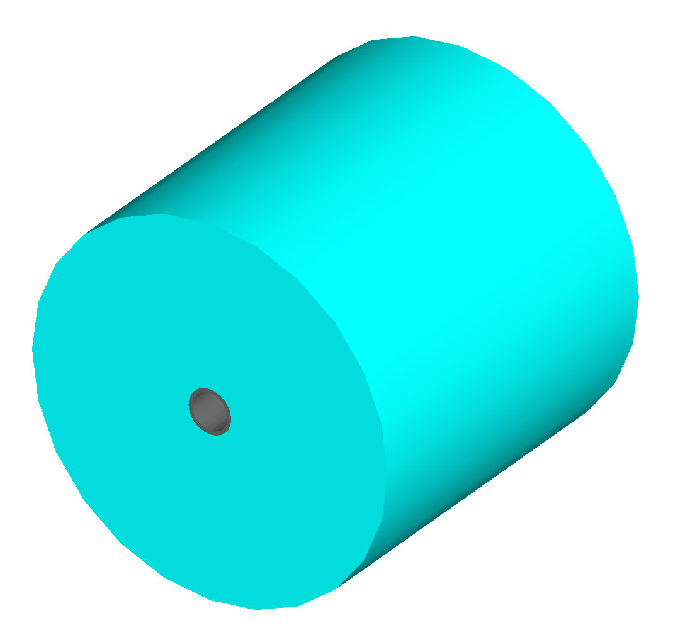

================================
Model Description - Input Syntax
================================

GMAD Syntax
-----------

GMAD is a language specifically for BDSIM but is made to be human readable
and very similar to MADX.

* arithmetic expressions can be defined
* binary operators +, -, \*, /, ^ are valid
* unary operators +, -, are valid
* boolean operators <, >, <=, >=, <>, == are valid
* every expression **must** end with a semi-colon;

The following functions are provided

* sqrt
* cos
* sin
* tan
* exp, e
* log
* acos
* asin
* abs

Examples
^^^^^^^^
::

   x = 1;
   y = 2.5-x;
   z = sin(x) + log(y) -8e5;

Coordinates & Units
-------------------

In Geant4, global euclidean coordinates are used for tracking purposes, however,
in describing a lattice with BDISM, curvlinear coordinates are used as is common with
accelerators (X,Y,S).

**GMAD uses SI units.**

==============================  =========================
Name                            Units
==============================  =========================
length                          [m] (metres)
time                            [s] (seconds)
angle                           [rad] (radians) 
quadrupole coefficient          [m :math:`^{-2}` ]
multipole coefficient 2n poles  [m :math:`^{-n}` ]
electric voltage                [MV] (Megavolts)
electric field strength         [MV/m]
particle energy                 [GeV]
particle mass                   [GeV/c :math:`^2` ]
particle momentum               [GeV/c :math:`^2` ]
beam current                    [A] (Amperes)
particle charge                 [e] (elementary charges)
emittances                      [pi m mrad]
density                         [g/cm :math:`^{3}` ] 
temperature                     [K] (Kelvin)
pressure                        [atm] (atmosphere)
mass number                     [g/mol]
==============================  =========================

Some useful predefined values / units are:

==========  =================================
Name        Value
==========  =================================
pi          3.14159265358979
GeV         1
eV          :math:`10^{-9}`
KeV         :math:`10^{-6}`
MeV         :math:`10^{-3}`
TeV         :math:`10^{3}`
MV          1
Tesla       1
rad         1
mrad        :math:`10^{-3}`
clight      :math:`2.99792458 \times 10^{-9}`
m           1
cm          :math:`10^{-2}`
mm          :math:`10^{-3}`
um          :math:`10^{-6}`
nm          :math:`10^{-9}`
s           1
ms          :math:`10^{-3}`
us          :math:`10^{-6}`
ns          :math:`10^{-9}`
==========  =================================

For example, one can write either 100*eV or 0.1*KeV to specify an energy in GMAD
and both are equivalent.

Lattice Description
-------------------

A model of the accelerator is given to BDSIM via input text files in the GMAD language.
The overall program strucutre should follow:

1) Component definition
2) Sequence defention (of the already defined components)
3) Which sequence to use
4) Where to record output (samplers)
5) A beam distribution
6) Options, including which physics lists, number to simulate etc.

These are described in the following sections

Lattice Elements
----------------

Any element in BDSIM is descrbied with the following pattern::

  type: name, paramter=value, parameter="string";

.. note:: Notice the ':', the inverted commas for a string parameter and that each
	  functional line must end with a semi-colon. Spaces will be ignored

The following elements may be defined

* `drift`_
* `rbend`_
* `sbend`_
* `quadrupole`_
* `sextupole`_
* `octupole`_
* `decapole`_
* `multipole`_
* `vkick`_
* `hkick`_
* `rf`_
* `rcol`_
* `ecol`_
* `solenoid`_
* `laser`_
* `transform3d`_
* `element`_
* `marker`_

These are detailed in the following sections.

drift
^^^^^

.. figure:: figures/drift.png
	    :width: 30%
	    :align: right

:code:`drift` defines a straight beam pipe with no field.

Required attributes:

================  ===================  ==========  =========
parameter         description          default     required
`l`               length [m]           0.1         yes
`vacuumMaterial`  the vacuum material  vacuum      no
                  to use, can be user
		  defined
================  ===================  ==========  =========

rbend
^^^^^
.. figure:: figures/rbend.png
	    :width: 30%
	    :align: right

sbend
^^^^^

.. figure:: figures/sbend.png
	    :width: 30%
	    :align: right

quadrupole
^^^^^^^^^^

.. figure:: figures/quadrupole.png
	    :width: 30%
	    :align: right

sextupole
^^^^^^^^^

.. figure:: figures/sextupole.png
	    :width: 30%
	    :align: right

octupole
^^^^^^^^

decapole
^^^^^^^^

multipole
^^^^^^^^^

vkick
^^^^^

hkick
^^^^^

rf
^^^^

rcol
^^^^

ecol
^^^^

solenoid
^^^^^^^^

laser
^^^^^

transform3d
^^^^^^^^^^^

element
^^^^^^^

marker
^^^^^^

Aperture Parameters
^^^^^^^^^^^^^^^^^^^

+-----------------+--------------+-------------------+-----------------+---------------+---------------+
| Aperture Model  | # of         | aper1             | aper2           | aper3         | aper4         |
|                 | parameters   |                   |                 |               |               |
+=================+==============+===================+=================+===============+===============+
| circular        | 1            | radius            | NA              | NA            | NA            |
+-----------------+--------------+-------------------+-----------------+---------------+---------------+
| rectangular     | 2            | x half width      | y half width    | NA            | NA            |
+-----------------+--------------+-------------------+-----------------+---------------+---------------+
| elliptical      | 2            | x semi-axis       | y semi-axis     | NA            | NA            |
+-----------------+--------------+-------------------+-----------------+---------------+---------------+
| lhcscreensimple | 3            | x half width of   | y half width of | radius of     | NA            |
|                 |              | rectangle         | rectangle       | circle        |               |
+-----------------+--------------+-------------------+-----------------+---------------+---------------+
| lhcscreen       | 3            | x half width of   | y half width of | radius of     | NA            |
|                 |              | rectangle         | rectangle       | circle        |               |
+-----------------+--------------+-------------------+-----------------+---------------+---------------+
| rectellipse     | 4            | x half width of   | y half width of | x semi-axis   | y semi-axis   |
|                 |              | rectangle         | rectangle       | of ellipse    | of ellipse    |
+-----------------+--------------+-------------------+-----------------+---------------+---------------+
| racetrack       | 3            | horizontal offset | vertical offset | radius of     | NA            |
|                 |              | of circle         | of circle       | circular part |               |
+-----------------+--------------+-------------------+-----------------+---------------+---------------+
| octagon         | 4            | x half width      | y half width    | angle 1 [rad] | angle 2 [rad] |
+-----------------+--------------+-------------------+-----------------+---------------+---------------+

Lattice Sequence
----------------

Samplers - Output
-----------------

Physics Lists
-------------

Options
-------

Beam Parameters
---------------

.. _distributions-section:

Beam Distributions
------------------

- gauss
- gaussTwiss
- reference

after reading this, go back to the top in :ref:`distributions-section`

You can also have a look in another document at :ref:`output-analysis-section`

These parameters can be set with the *option* command as the default parameters
and also on a per element basis, that overrides the defaults for that specific element.
Up to four parameters
can be used to specify the aperture shape (*aper1*, *aper2*, *aper3*, *aper4*).
These are used differently for each aperture model and match the MADX aperture definitions.
The required parameters and their meaning are given in the following table.

Currently, only circular and rectangular are implemented.  More models will be completed shortly.

The outer volume is represented (with the exception of the *drift* 
element) by a cylinder with inner radius equal to the beampipe outer radius and
with outer radius given by default by the global *boxSize* option, which
can usually be overridden with the *outR* option.

In Geant4 it is possible to drive different *regions* each with their own production cuts and user limits.
In BDSIM three different regions exist, each with their own user defined production cuts (see *Physics*). 
These are the default region, the precision region and the approximation region. Beamline elements 
can be set to the precision region by setting the attribute *precisionRegion* equal to 1. For example:
