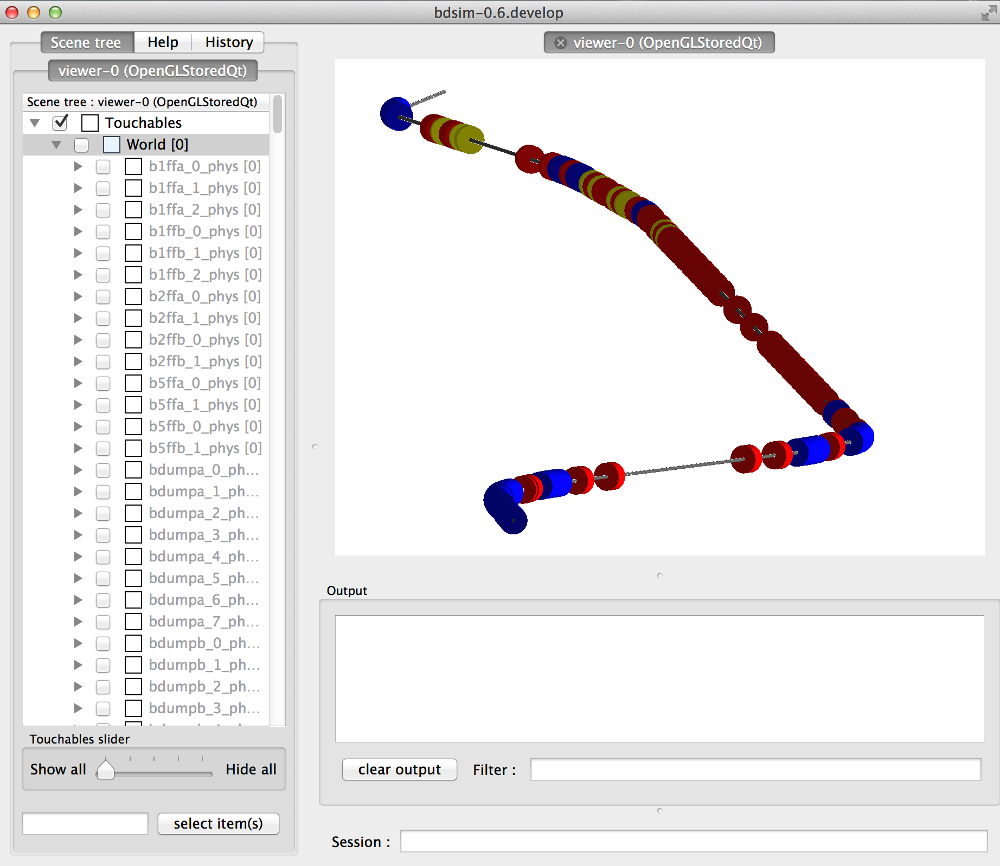

=============
Running BDSIM
=============

BDSIM can be executed in a terminal with extra arguments to specify various inputs.
The angular brackets should not be used.

+----------------------------+----------------------------------------------+
| --file=<file>              | specify the input gmad file                  |
+----------------------------+----------------------------------------------+
| --output=<fmt>             | output format "root", "ascii" (default)
or combined   |
+----------------------------+----------------------------------------------+
| --outfile=<file>           | output file name. Will be appended with _N   |
|                            | where N = 0, 1, 2, 3...                      |
+----------------------------+----------------------------------------------+
| --vis\_mac=<file>          | visualization macro script, default vis.mac  |
+----------------------------+----------------------------------------------+
| --gflash=<N>               | whether or not to turn on gFlash fast shower |
|                            | parameterisation.                            |
+----------------------------+----------------------------------------------+
| --gflashemax=<N>           | maximum energy for gflash shower             |
|                            | parameterisation in GeV.                     |
+----------------------------+----------------------------------------------+
| --gflashemin=<N>           | minimum energy for gflash shower             |
|                            | parameterisation in GeV.                     |
+----------------------------+----------------------------------------------+
| --help                     | display this message.                        |
+----------------------------+----------------------------------------------+
| --verbose                  | display general parameters before run        |
+----------------------------+----------------------------------------------+
| --verbose\_event           | display information for every event          |
+----------------------------+----------------------------------------------+
| --verbose\_step            | display tracking information after each step |
+----------------------------+----------------------------------------------+
| --verbose\_event\_num=<N>  | display tracking information for event N     |
+----------------------------+----------------------------------------------+
| --batch                    | batch mode - no graphics                     |
+----------------------------+----------------------------------------------+
| --outline=<file>           | print geometry / optics info to <file>       |
+----------------------------+----------------------------------------------+
| --outline_type=<fmt>       | type of outline format where fmt is one of   |
|                            | "optics" or "survey"                         |
+----------------------------+----------------------------------------------+
| --materials                | list materials included in BDSIM by default  |
+----------------------------+----------------------------------------------+
| --circular                 | assume circular machine - turn control       |
+----------------------------+----------------------------------------------+
| --seed=<N>                 | seed for the random number generator         |
+----------------------------+----------------------------------------------+
| --seedstate=<file>         | file containing CLHEP::Random seed state     |
|                            | NB \- this overrides other seed value        |
+----------------------------+----------------------------------------------+

BDSIM can be run in one of two ways, `interactively`_, or `in batch mode`_, which
are described in the following sections.

When run interactively, a Geant4 visualiser is invoked that produces a window with an image
of the BDSIM model as well as a terminal prompt to control it. No events are simulated
without user input. Alternatively, BDSIM can be run in batch mode, where no visualiser
is used and the specified number of primary events is simulated and feedback printed
to the terminal. Batch mode is typically much faster than the interactive mode, but
the interactive mode is very useful for understanding the model and a typical event
in the simulation - ie where a particle hits.

Interactively
=============

Features:

* default option
* interactive visualisation of accelerator model
* ability to run individual events
* typically slower than batch mode
* no events run without user input

To execute BDSIM in interactive mode, the user must simply not use the :code:`--batch` command.
The user must also specify a macro file using the :code:`--vis_mac` option above otherwise, BDSIM
will look for "vis.mac" in the current working directory. If not found, BDSIM will exit. Once
executed a window such as this will appear (depending on the visualiser you use).

   BDSIM running interactively with OpenGL Qt visualiser from Geant4.

Note, the visualiser is part of Geant4 so if the desired visualiser isn't available, you
must recompile Geant4 with the correct visualiser (and subsequently BDSIM afterwards). Geant4
also uses the Cmake configuration system. The visualiser shown is the OpenGL Qt visualiser, which
we recommend for its ease of use and high level of interactivity.

Example vis.mac files can be found in the supplied BDSIM examples.

.. note:: BDSIM simulates one particle at a time from the primary distribution and all of the
	  associated secondaries. Each event is independent and different particles in the input
	  bunch cannot interact with each other or their secondaries. This is an underlying feature
	  of Geant4.

In Batch Mode
=============

Features:

* no interactive visualiser
* faster
* number of events run then program quits
* no user input
* typical use for a "job" on a farm

To execute BDSIM in batch mode, simply use the :code:`--batch` execution option.

Examples
========
::

   bdsim --file=atf2.gmad --output=root --outfile=test1 --batch --seed=123

This executes BDSIM for the ATF2 example with ROOT output to a file name "test1" in batch
mode with a seed value of 123. The simulation runs the number of events specified by the
:code:`ngenerate` options parameter in the input gmad file. ::

      bdsim --file=sm.gmad --outfile=test2

This executes BDSIM for the simpleMachine example with ASCII output (default) to a file named
"test2". The program is run interactively and the window in Figure appears. From here, the
user types::
  
  /run/beamOn 1

In the visualiser terminal to run one event and visualise it.

