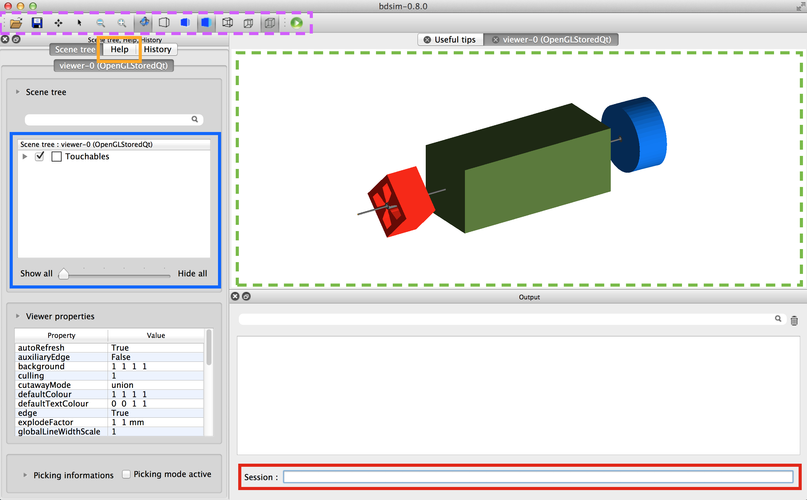

.. _visualisation:

=============
Visualisation
=============

When working interactively with BDSIM, the Geant4 visualisers are used. When
BDSIM is started interactively (without the :code:`--batch` command), Geant4
will print a list of all available visualisers that Geant4 has been compiled
with on your system. Should you wish to extend this list, you must follow
the Geant4 instructions, which typically involves installing the necessary
dependencies (such as qt4), reconfiguring and recompiling Geant4. BDSIM
should then be subsequently reconfigured (rerun cmake) and recompiled.

As an example an excerpt from the terminal output shows the following list
of available visualisers on an example system.

By default, BDSIM uses the **OpenGL Qt** visualiser - we highly recommend this
as it's very easy to work with and has a rich feature set.

Default and Custom Visualisation
================================

Strictly speaking, a visualisation macro must be supplied to Geant4 to
tell it what to display. For convenience, BDSIM provides a set of macros
that dsplay the geometry, add a few useful buttons and menus to the
user interface. To uses these, the user need only **not** speficy a
visualisation macro.::

  bdsim --file=mylattice.gmad

* Note, no :code:`--batch` command

If you wish to use a different visualiser, you may specify this by using
your own visualisation macro with BDSIM. This can be done using the following
command::

  bdsim --file=mylattice.gmad --vis_mac=othervis.mac

where :code:`othervis.mac` is your visualisation macro.

The BDSIM visualisation macros can be found in the bdsim source directory as
follows::

  bdsim/vis/*.mac

Visualisation Features
======================

The default Open GL Qt visualiser is shown below.

The visualiser is shown again below with some interesting parts highlighted. These are:

* **Green dashed box middle** Main visualiser window - view of the model.
* **Purple dashed box top left** Control buttons that are described in more detail in `Control Buttons`_.
* **Blue box on the left** Scene tree - expand this to see a full list of all volumes
  in the simulation.
* **Orange box top left** Help browser where you can search for all commands in the visualiser.
* **Red box bottom** Session - enter commands here.

.. note:: You must use "exit" in the session box at the bottom to exit BDSIM properly.

   
  
Control Buttons
---------------

Common Useful Commands
----------------------

A list of our most commonly used commands

* :code:`/vis/viewer/set/viewpointThetaPhi 0 90` - set the view point angle
* :code:`/vis/scene/add/axes 0 0 0` - add a set of unit vector axes at position (0,0,0)
* :code:`/run/beamOn 3` - run 3 primary events
* :code:`exit` - exit the visualiser and BDSIM
